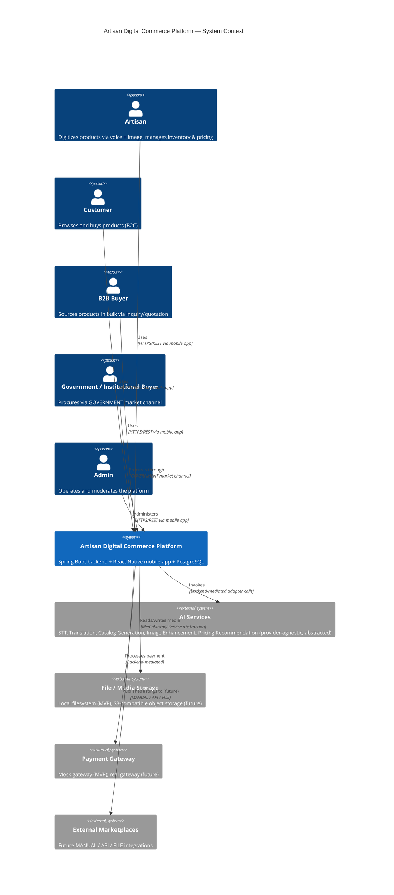

# 02 — Architecture Overview

## 1. System Context Diagram (C4 Level 1)

## 2. Component Diagram (C4 Level 2)

```mermaid
C4Container
title Artisan Digital Commerce Platform — Container/Component View

Person(users, "Artisan / Customer / B2B Buyer / Admin")

Container(mobile, "Mobile App", "React Native + TypeScript + Expo", "Android-first, iOS-compatible architecture")

Container_Boundary(backend, "Backend (Spring Boot, single deployable — modular monolith)") {
  Component(auth, "Identity/Auth Module", "Spring Security", "AuthN/AuthZ, users, roles, addresses")
  Component(seller, "Seller Module", "Spring Boot", "Sellers, artisan profiles")
  Component(catalog, "Catalog Module", "Spring Boot", "Categories, products, SKUs, attributes")
  Component(media, "Media Module", "Spring Boot", "Media asset metadata + MediaStorageService")
  Component(inventory, "Inventory Module", "Spring Boot", "Stock levels, movements")
  Component(ai, "AI Module", "Spring Boot", "AI job orchestration + adapters")
  Component(pricing, "Pricing Module", "Spring Boot", "Cost records, market prices, SKU prices")
  Component(market, "Market Module", "Spring Boot", "Market channels/listings, external marketplaces")
  Component(b2b, "B2B Module", "Spring Boot", "Buyers, inquiries, quotations, purchase orders")
  Component(commerce, "Commerce Module", "Spring Boot", "Carts, orders, order status history")
  Component(payment, "Payment Module", "Spring Boot", "Payments, transactions, refunds, settlements, invoices")
  Component(fulfillment, "Fulfillment Module (PROPOSED)", "Spring Boot", "Shipments, delivery events")
  Component(experience, "Experience Module (PROPOSED)", "Spring Boot", "Reviews, ratings")
}

ContainerDb(postgres, "PostgreSQL", "artisan_marketplace", "13 domain schemas")
Container(storage, "File / Media Storage", "Local filesystem (MVP) / S3 (future)", "Binary media storage")
Container_Ext(aiAdapters, "AI Service Adapters", "Pluggable AI providers", "STT / Translation / Catalog Gen / Image Enhance / Pricing")
Container_Ext(paymentAdapter, "Payment Gateway Adapter", "Mock (MVP) / Real (future)")

Rel(users, mobile, "Uses")
Rel(mobile, auth, "REST /api/v1/auth/*", "HTTPS")
Rel(mobile, catalog, "REST /api/v1/products/*", "HTTPS")
Rel(mobile, media, "REST /api/v1/media/*", "HTTPS")
Rel(mobile, ai, "REST /api/v1/ai/*", "HTTPS")

Rel(auth, postgres, "Reads/writes", "identity schema")
Rel(seller, postgres, "Reads/writes", "seller schema")
Rel(catalog, postgres, "Reads/writes", "catalog schema")
Rel(media, postgres, "Reads/writes metadata", "media schema")
Rel(inventory, postgres, "Reads/writes", "inventory schema")
Rel(ai, postgres, "Reads/writes", "ai schema")
Rel(pricing, postgres, "Reads/writes", "pricing schema")
Rel(market, postgres, "Reads/writes", "market schema")
Rel(b2b, postgres, "Reads/writes", "b2b schema")
Rel(commerce, postgres, "Reads/writes", "commerce schema")
Rel(payment, postgres, "Reads/writes", "payment schema")
Rel(fulfillment, postgres, "Reads/writes (proposed)", "fulfillment schema")
Rel(experience, postgres, "Reads/writes (proposed)", "experience schema")

Rel(media, storage, "Stores/retrieves binaries", "MediaStorageService")
Rel(ai, aiAdapters, "Invokes", "provider-agnostic interface")
Rel(payment, paymentAdapter, "Invokes", "provider-agnostic interface")
```

## 3. Architectural Style

### 3.1 Decision: Modular Monolith

The platform is built as **one deployable Spring Boot application, internally decomposed into domain modules** that map one-to-one to the 13 PostgreSQL schemas (source §7, §29). It is explicitly **not** a microservices architecture for this phase.

### 3.2 Justification

- Source §6 depicts a single "BACKEND / Spring Boot" container holding Authentication, Seller, Catalog, Media, Inventory, AI, Pricing, Market, B2B, Commerce, Payment, and Fulfillment as internal concerns of one box — not as separate deployed containers.
- Source §29 prescribes one `backend/` repository tree with subpackages per domain (`auth/`, `seller/`, `catalog/`, ...), each following the same Controller → Service → Repository → Database layering — a textbook modular-monolith package structure, not a polyrepo/per-service structure.
- Principle #43 (Hackathon MVP Principle) explicitly instructs prioritizing requirement coverage over enterprise scope, and principle #2 forbids introducing new technology when existing technology already satisfies the requirement — a distributed system would require a message broker, service discovery, and distributed transaction handling that nothing in the source calls for.
- Principle #11 ("B2C, B2B, and Government commerce should use common commerce/order infrastructure wherever practical") and principle #16 ("Existing structures should be extended rather than duplicated") both favor a single shared codebase and database over siloed per-channel services.
- The design still honors the stated "loosely coupled, extensible" philosophy (§1, §44): each module owns its schema exclusively, communicates with other modules through service-layer interfaces (not direct cross-schema repository access), and could be extracted into an independent service later without a data model redesign, since bounded contexts are already schema-aligned (see `03_SERVICE_BOUNDARIES.md`).

### 3.3 Consequence for Terminology

Wherever this document set uses the word "service" for a domain (e.g., in `03_SERVICE_BOUNDARIES.md`, `16_ADR_PACK.md`), it refers to a **module within the single backend deployable**, not an independently deployed microservice, unless explicitly stated otherwise. This distinction is carried consistently across all 17 documents.

> ⚠️ Open Question: The source's own architectural-style vocabulary is ambiguous between "domain-oriented Spring Boot backend" (§29) and generic references to "services" (§6 diagram labels, §14 "AI services", §31). This document set resolves it as a modular monolith with domain modules; if the team's actual intent was distributed microservices from day one, this is a material architecture change requiring approval per principle #17 — blocks: 02_ARCHITECTURE_OVERVIEW.md, 03_SERVICE_BOUNDARIES.md, 06_COMMUNICATION_WORKFLOWS.md, 07_QUEUE_AND_CACHE_DESIGN.md

## 4. Technology Stack by Layer

| Layer | Technology | Rationale |
|---|---|---|
| Mobile frontend | React Native + TypeScript + Expo | Explicit in source §5; Android-first for hackathon, Expo simplifies build/tooling for APK/AAB output; TypeScript enforced for type safety across a large screen surface (source §27 lists 14 frontend responsibility areas). |
| Backend framework | Java + Spring Boot + Spring Security + Maven | Explicit in source §5; Spring Security is the natural fit for REST AuthN/AuthZ in a Java stack; Maven is the specified build tool. |
| API style | REST, base path `/api/v1` | Explicit in source §5, §30. No GraphQL/gRPC is mentioned or implied anywhere in the workflow. |
| Database | PostgreSQL, database `artisan_marketplace`, 13 domain schemas | Explicit in source §5, §6, §7. Schemas (not separate databases) achieve domain separation while keeping referential integrity and transactional consistency achievable within one engine (principle #33.1). |
| Migrations | Flyway, `V0xx__description.sql` versioned files under `database/migrations/` | Explicit in source §36 ("Spring Boot should eventually use Flyway"). |
| AI integration | Backend-owned adapters behind a provider-agnostic interface | Source §5 ("exact AI provider/model can be changed without changing the core domain model") and §31 (AI development rules mandate an abstraction layer). |
| Media storage | Local filesystem (MVP) behind `MediaStorageService`, with `LocalMediaStorage` and `S3MediaStorage` implementations | Explicit in source §5, §12. |
| Auth mechanism | Spring Security-issued token (mechanism detail PROPOSED — see `08_SECURITY_AND_VAULT.md`) | Spring Security is explicit; exact token scheme (JWT vs. session) is not stated in source and is reasoned as the minimal standard fit for a stateless mobile REST client. |
| CI/CD | GitHub Actions (PROPOSED) | Git/GitHub usage is explicit in source §28, §34; GitHub Actions is the platform-native CI choice requiring no additional vendor, consistent with principle #2. |
| Deployment target | "Suitable cloud/server environment," exact provider unspecified | Explicit non-decision in source §28 ("exact provider is an implementation/deployment decision and is not hard-coded into the architecture"). |

> ⚠️ Open Question: Auth token mechanism, CI/CD platform, and deployment provider are not specified in the workflow; the choices above are the minimal-new-technology defaults and are marked PROPOSED pending team approval — blocks: 02_ARCHITECTURE_OVERVIEW.md, 08_SECURITY_AND_VAULT.md, 10_CI_CD_AND_ENVIRONMENTS.md, 16_ADR_PACK.md

## 5. Multi-Tenancy Model

The source workflow describes a single shared marketplace database (`artisan_marketplace`) used by all sellers and buyers, with tenancy expressed at the row level through ownership foreign keys (`seller.sellers.user_id`, `catalog.products.seller_id`), not through separate databases, schemas-per-tenant, or a tenant-routing gateway. This is consistent with a marketplace model (many sellers and buyers sharing one platform instance), as opposed to a B2B SaaS model where each customer organization needs a hard isolation boundary.

### 5.1 Tenant Isolation Strategy

**Row-level ownership isolation.** Every tenant-scoped entity (products, SKUs, inventory, media, pricing, orders, etc.) carries a foreign key back to the owning `seller` or `user`, and backend service-layer authorization enforces that a seller can only read/write records they own. This is the natural reading of a marketplace architecture where "tenant" effectively means "seller" or "buyer account," not "isolated organization with its own schema."

> ⚠️ Open Question: The source does not use the word "tenant" or describe multi-tenancy explicitly at all — it describes a single shared marketplace. The row-level ownership model above is the most direct implication of the seller/buyer/order ownership relationships already in the schema, but if the team intends true multi-tenant SaaS (e.g., white-labeled marketplace instances per organization), that is a materially different, unapproved architecture change — blocks: 02_ARCHITECTURE_OVERVIEW.md, 04_DATA_MODEL_AND_OWNERSHIP.md, 08_SECURITY_AND_VAULT.md

### 5.2 Tenant Routing Mechanism

Not applicable under the row-level ownership model — all requests hit the same single backend deployment and database; routing is by authenticated identity (JWT/session subject), not by tenant subdomain, header, or database connection string.

### 5.3 Per-Tenant Configuration / Feature Flags

Not described in the source. No per-seller or per-buyer-organization configuration or feature flag capability is implied by the data model (no `settings`, `config`, or `feature_flags` table appears anywhere in §38's table inventory).

> ⚠️ Open Question: No per-tenant configuration or feature-flag mechanism exists in the source data model — blocks: 02_ARCHITECTURE_OVERVIEW.md, 10_CI_CD_AND_ENVIRONMENTS.md

### 5.4 Tenant Onboarding / Offboarding

Onboarding is "Artisan onboarding," explicitly listed as MVP priority #1 (source §43): a user registers (`identity.users`), is assigned the ARTISAN role, creates a `seller` record and an `artisan_profiles` record. Offboarding (account deactivation, data retention/erasure) is not described in the source.

> ⚠️ Open Question: No seller/user offboarding, deactivation, or data-erasure workflow is defined in the source — blocks: 02_ARCHITECTURE_OVERVIEW.md, 08_SECURITY_AND_VAULT.md

## 6. Key Architectural Principles (source §4, restated as binding constraints)

1. Do not redesign the architecture without explicit approval.
2. Do not introduce new technology when existing technology already satisfies the requirement.
3. Avoid duplicate domain entities.
4. Keep frontend, backend, database, AI, and file/media responsibilities separated.
5. Frontend communicates with backend only through APIs.
6. Frontend must never directly access PostgreSQL.
7. Backend owns business logic and orchestration.
8. AI services are supporting capabilities, not owners of core business data.
9. AI results pass through backend validation and, where appropriate, user approval before modifying core entities.
10. Product and SKU remain separate concepts.
11. B2C, B2B, and Government commerce share common commerce/order infrastructure wherever practical.
12. Media binaries are never stored directly in PostgreSQL.
13. PostgreSQL stores media metadata and storage references only.
14. External integrations are isolated behind service interfaces/adapters.
15. Database integrity constraints live in PostgreSQL; business-rule changes live in the application/service layer.
16. Existing structures are extended, not duplicated.
17. Any proposed architecture change is marked **PROPOSED** until approved.

## 7. Hard Constraints (non-negotiable without explicit approval)

- Cannot replace PostgreSQL.
- Cannot replace Spring Boot.
- Cannot introduce a second competing architecture (e.g., a parallel microservices layer alongside the monolith).
- Cannot create a second Product entity or duplicate B2C/B2B product tables.
- Cannot store media binaries, plaintext passwords, or payment card data in PostgreSQL.
- Cannot let the frontend connect directly to PostgreSQL.
- Cannot let AI directly modify core business entities without backend validation.
