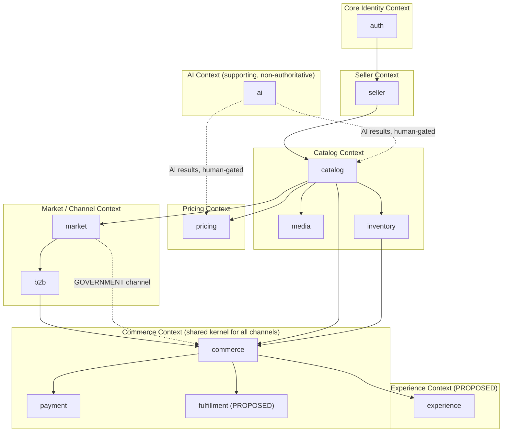
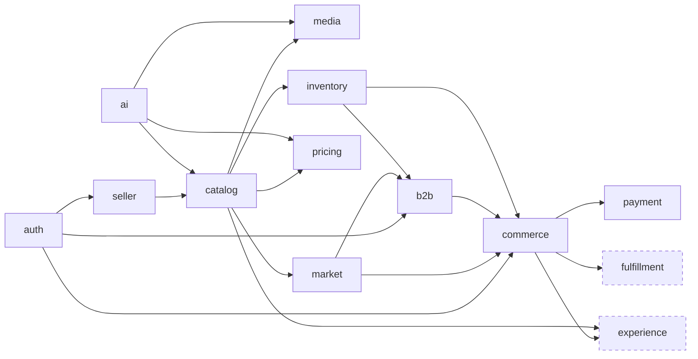

# 03 — Service Boundaries

> **Terminology note:** as established in `02_ARCHITECTURE_OVERVIEW.md` §3, this platform is a modular monolith. "Service" below means a domain module inside the single Spring Boot deployable, each with its own package, owned schema, and internal Controller → Service → Repository layering (source §29) — not an independently deployed microservice.

## 1. Full Module Catalogue

| # | Module (backend package) | Owned Schema | Domain Responsibility |
|---|---|---|---|
| 1 | `auth` | `identity` | AuthN/AuthZ, user accounts, roles, addresses |
| 2 | `seller` | `seller` | Seller accounts, artisan profiles |
| 3 | `catalog` | `catalog` | Categories, products, SKUs, product attributes |
| 4 | `media` | `media` | Media asset metadata, product-media linkage, storage abstraction |
| 5 | `inventory` | `inventory` | Stock levels and stock movement history |
| 6 | `ai` | `ai` | AI job orchestration, voice/transcription/translation/catalog-gen/image/pricing results |
| 7 | `pricing` | `pricing` | Cost records, market price references, SKU prices |
| 8 | `market` | `market` | Market channels, market listings, external marketplace integration |
| 9 | `b2b` | `b2b` | B2B buyers, inquiries, quotations, purchase orders |
| 10 | `commerce` | `commerce` | Carts, orders, order items, order status history |
| 11 | `payment` | `payment` | Payments, transactions, refunds, settlements, invoices |
| 12 | `fulfillment` (PROPOSED) | `fulfillment` | Shipments, delivery events |
| 13 | `experience` (PROPOSED) | `experience` | Reviews, ratings |

> ⚠️ Open Question: Source §29's recommended backend structure names the identity/auth package `auth/`, while source §7/§8 names the schema `identity`. This document uses `auth` as the module/package name and `identity` as the schema name per the source's own literal spellings, but the mismatch itself was never reconciled in the workflow — blocks: 03_SERVICE_BOUNDARIES.md, 15_REPOSITORY_STRUCTURE.md

## 2. Per-Module Detail

### 2.1 `auth` (Identity)

- **Responsibility:** Registration, authentication, role assignment, address book management.
- **Owned data:** `identity.users`, `identity.roles`, `identity.user_roles`, `identity.addresses`.
- **Exposes:** `POST /api/v1/auth/login`, registration, address CRUD, current-user profile endpoints; issues the auth token consumed by every other module.
- **Consumes:** Nothing from other modules (identity is the dependency root).

### 2.2 `seller`

- **Responsibility:** Seller account lifecycle, artisan-specific profile data, seller type classification.
- **Owned data:** `seller.sellers`, `seller.artisan_profiles`.
- **Exposes:** Seller registration/profile endpoints (conceptually under `/api/v1/sellers`, not enumerated with a literal path in source — see `05_API_CONTRACTS.md`).
- **Consumes:** `auth` (a seller must resolve to an existing `identity.users` record).

### 2.3 `catalog`

- **Responsibility:** Category hierarchy, product definitions, SKU variants, flexible product attributes.
- **Owned data:** `catalog.categories`, `catalog.products`, `catalog.product_skus`, `catalog.product_attributes`.
- **Exposes:** `GET/POST /api/v1/products`, `GET/PUT /api/v1/products/{id}` (explicit in source §30), plus category and SKU endpoints (implied, not literally enumerated).
- **Consumes:** `seller` (ownership), `ai` (accepts AI-generated catalog drafts pending artisan review — read-only consumption of `ai.catalog_generations` output, never a write-back dependency in the other direction).

### 2.4 `media`

- **Responsibility:** Media asset metadata, storage abstraction, product-media association.
- **Owned data:** `media.media_assets`, `media.product_media`.
- **Exposes:** `POST /api/v1/media/upload` (explicit in source §30).
- **Consumes:** `catalog` (association target), storage abstraction (`MediaStorageService` → `LocalMediaStorage`/`S3MediaStorage`, not a module but an infrastructure interface owned by `media`).

### 2.5 `inventory`

- **Responsibility:** Current stock state and stock movement ledger per SKU.
- **Owned data:** `inventory.inventories`, `inventory.inventory_movements`.
- **Exposes:** Stock query/adjustment endpoints (implied, not literally enumerated in source §30).
- **Consumes:** `catalog` (`product_skus` foreign key), `commerce` (reservation/release triggered by cart/order lifecycle), `b2b` (reservation for bulk purchase commitments per source §13).

### 2.6 `ai`

- **Responsibility:** Orchestrates every AI-assisted step; owns job records and every intermediate/AI-result record.
- **Owned data:** `ai.ai_jobs`, `ai.voice_inputs`, `ai.speech_transcriptions`, `ai.translations`, `ai.catalog_generations`, `ai.image_processing_results`, `ai.price_recommendations`.
- **Exposes:** `POST /api/v1/ai/catalog/generate`, `POST /api/v1/ai/image/enhance`, `POST /api/v1/ai/pricing/recommend` (explicit in source §30), plus a voice-input/transcription/translation submission endpoint (implied by the flow in source §15, not literally enumerated).
- **Consumes:** `media` (voice recordings and product images are media assets), external AI provider adapters (isolated behind interfaces per principle #14).
- **Produces results consumed by, but never writes directly into:** `catalog` (catalog drafts), `pricing` (price recommendations) — both require explicit backend validation and artisan/seller approval before becoming core entities (principle #9, #31.7).

### 2.7 `pricing`

- **Responsibility:** Cost accounting inputs, market price reference data, actual SKU pricing with validity periods.
- **Owned data:** `pricing.cost_records`, `pricing.market_prices`, `pricing.sku_prices`.
- **Exposes:** Price CRUD and price-history endpoints (implied).
- **Consumes:** `catalog` (SKU foreign key), `ai` (recommendation input, human-gated).

### 2.8 `market`

- **Responsibility:** Market channel definitions, per-channel listing state, external marketplace integration surface.
- **Owned data:** `market.market_channels`, `market.market_listings`, `market.external_marketplaces`, `market.external_listings`.
- **Exposes:** Listing management endpoints (implied).
- **Consumes:** `catalog` (product being listed).
- **Consumed by:** `b2b` (a B2B inquiry targets a product that must be market-listed under B2B), government/institutional flow (GOVERNMENT channel), `commerce` (order `source_type` conceptually aligns with market channel, though it is stored independently per §21).

### 2.9 `b2b`

- **Responsibility:** B2B buyer organization records, inquiry/quotation negotiation, purchase order issuance.
- **Owned data:** `b2b.b2b_buyers`, `b2b.b2b_inquiries`, `b2b.b2b_quotations`, `b2b.purchase_orders`.
- **Exposes:** Inquiry/quotation/purchase-order endpoints (implied).
- **Consumes:** `auth` (buyer identity), `catalog` (product being inquired about), `market` (B2B channel listing), `inventory` (bulk reservation), `commerce` (purchase order must resolve into an order).

### 2.10 `commerce`

- **Responsibility:** The single, shared order pipeline for all three market channels.
- **Owned data:** `commerce.carts`, `commerce.cart_items`, `commerce.orders`, `commerce.order_items`, `commerce.order_status_history`.
- **Exposes:** Cart/checkout/order endpoints (implied).
- **Consumes:** `catalog`/`inventory` (cart line items reference SKUs and trigger reservation), `b2b` (accepted purchase order becomes an order with `source_type = B2B`), government/institutional flow (institutional purchase becomes an order with `source_type = GOVERNMENT`).
- **Consumed by:** `payment` (order is the payment target), `fulfillment` (PROPOSED — order is the fulfillment target).

### 2.11 `payment`

- **Responsibility:** Payment lifecycle, transaction outcomes, refunds, seller settlement computation, invoicing.
- **Owned data:** `payment.payments`, `payment.payment_transactions`, `payment.refunds`, `payment.seller_settlements`, `payment.invoices`.
- **Exposes:** Payment initiation/status/refund endpoints (implied).
- **Consumes:** `commerce` (order being paid), external payment gateway adapter (mock for MVP).

### 2.12 `fulfillment` (PROPOSED)

- **Responsibility:** Shipment tracking and delivery events against a confirmed/paid order.
- **Owned data (PROPOSED):** `fulfillment.fulfillments`, `fulfillment.shipments`, `fulfillment.shipment_items`, `fulfillment.delivery_events`.
- **Exposes (PROPOSED):** Fulfillment/shipment/tracking endpoints.
- **Consumes:** `commerce` (order and order items).
- **Produces:** Status updates that feed back into `commerce.order_status_history` (SHIPPED, DELIVERED).

> ⚠️ Open Question: Fulfillment module boundary is PROPOSED and unapproved (source §23) — blocks: 03_SERVICE_BOUNDARIES.md

### 2.13 `experience` (PROPOSED)

- **Responsibility:** Post-delivery customer feedback.
- **Owned data (PROPOSED):** `experience.reviews`, `experience.ratings`.
- **Exposes (PROPOSED):** Review/rating submission and retrieval endpoints.
- **Consumes:** `commerce` (delivered order/order item as the review target), `catalog` (product being reviewed).

> ⚠️ Open Question: Experience module boundary is PROPOSED and unapproved (source §24); this module is also absent from the recommended backend package list in source §29 entirely, meaning even its package name was never specified — blocks: 03_SERVICE_BOUNDARIES.md, 15_REPOSITORY_STRUCTURE.md

## 3. Bounded Context Map



## 4. Inter-Service Dependency Graph



**Reading the graph:** an arrow `A --> B` means "B depends on A" (B calls into A's service layer or reads A's identifiers as foreign keys). There are no cycles — `auth` is the root dependency of the whole system, and `payment`/`fulfillment`/`experience` are the terminal leaves, consistent with the end-to-end workflow in source §26.

## 5. Shared Library Strategy and Shared-Nothing Policy

### 5.1 Shared-Nothing at the Data Layer

Each module owns its schema exclusively. No module's repository layer queries another module's tables directly — cross-module data needs are satisfied by calling the owning module's service layer (in-process method call, since this is a monolith, not a network call). This preserves the schema-per-domain boundary (source §7 "goal is domain separation") and keeps the system extractable into real microservices later without a data-access rewrite.

### 5.2 What Is Shared

A small `common`/`shared` library (not a domain schema) is warranted for cross-cutting concerns implied by the architecture rules even though not explicitly named in source:

- Common DTO/response envelope conventions (source §30, "API naming and response conventions should remain consistent across domains").
- Common exception handling / error response shape.
- Common auditing fields (created_at, updated_at) used across every entity in every schema.
- The `MediaStorageService` abstraction interface (owned conceptually by `media`, but its interface contract is a shared-library concern since no other module should reach storage directly).

> ⚠️ Open Question: The source does not explicitly define a shared/common library package; the items above are the minimum implied by "API naming and response conventions should remain consistent across domains" (§30) and by every schema needing the same audit-column pattern — blocks: 03_SERVICE_BOUNDARIES.md, 15_REPOSITORY_STRUCTURE.md

### 5.3 Shared-Nothing Policy Statement

- No module may import another module's repository or entity classes directly across the module boundary except through its published service interface.
- No module may run a cross-schema SQL join that spans domain boundaries in application code; if a read genuinely needs data from two domains, it is composed at the service layer from two service calls, not a cross-schema query.

## 6. Code Ownership Map (CODEOWNERS structure)

Since this is a hackathon team (source does not name distinct engineering sub-teams), ownership is expressed by module path rather than by named individuals, to be filled in with actual GitHub usernames/team handles once assigned:

```text
# CODEOWNERS (path -> owning reviewers, to be filled in by the team)

/backend/src/main/java/.../auth/          @identity-owner
/backend/src/main/java/.../seller/        @seller-owner
/backend/src/main/java/.../catalog/       @catalog-owner
/backend/src/main/java/.../media/         @media-owner
/backend/src/main/java/.../inventory/     @inventory-owner
/backend/src/main/java/.../ai/            @ai-owner
/backend/src/main/java/.../pricing/       @pricing-owner
/backend/src/main/java/.../market/        @market-owner
/backend/src/main/java/.../b2b/           @b2b-owner
/backend/src/main/java/.../commerce/      @commerce-owner
/backend/src/main/java/.../payment/       @payment-owner
/backend/src/main/java/.../fulfillment/   @fulfillment-owner   # PROPOSED module
/backend/src/main/java/.../experience/    @experience-owner    # PROPOSED module

/frontend/                                @frontend-owner
/database/migrations/                     @database-owner
/docs/                                    @architecture-owner
```

> ⚠️ Open Question: The source names no specific engineers, roles, or sub-teams beyond the generic "Engineering, QA, DevOps, Product" categories used later in the roadmap document — the placeholders above must be filled in by the actual hackathon team — blocks: 03_SERVICE_BOUNDARIES.md, 14_IMPLEMENTATION_ROADMAP.md
