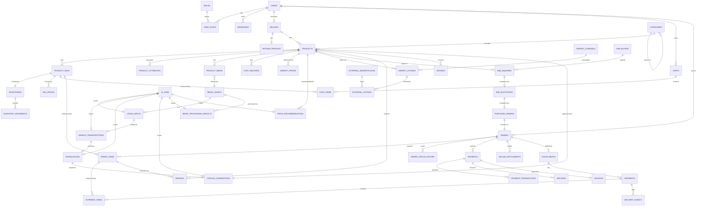

# 04 — Data Model and Ownership

All tables live in one PostgreSQL database, `artisan_marketplace`, partitioned into 13 schemas for domain separation (source §7). All primary keys are UUIDs (source §33.2). Every table additionally carries `created_at TIMESTAMPTZ NOT NULL DEFAULT now()` and `updated_at TIMESTAMPTZ NOT NULL DEFAULT now()` audit columns; these are omitted from the per-entity field lists below for brevity but are mandatory on every table.

## 1. Entity-Relationship Diagram



> Note: `FULFILLMENTS`, `SHIPMENTS`, `SHIPMENT_ITEMS`, `DELIVERY_EVENTS`, `REVIEWS`, `RATINGS` are PROPOSED entities (fulfillment and experience schemas, source §23–24) shown here to complete the diagram per the source's own "likely entities" / "potential schema" language; they require team approval before creation (principle #17).

## 2. Per-Entity Schema

### 2.1 Schema: `identity`

#### `identity.users`
| Field | Type | Constraints |
|---|---|---|
| id | UUID | PK, default `gen_random_uuid()` |
| email | VARCHAR(255) | UNIQUE, NOT NULL, indexed |
| password_hash | VARCHAR(255) | NOT NULL (hash only — never plaintext, source §8.1/§40) |
| full_name | VARCHAR(255) | NOT NULL |
| phone_number | VARCHAR(32) | nullable |
| account_status | VARCHAR(32) | NOT NULL, e.g. ACTIVE/SUSPENDED/DEACTIVATED (values PROPOSED — not enumerated in source) |
| email_verified | BOOLEAN | NOT NULL DEFAULT false |
| preferred_language | VARCHAR(16) | nullable (PROPOSED — supports multilingual commerce goal, §1, not explicitly modeled in source) |

Owned by: `auth` module. Index: `idx_users_email` (unique).

> ⚠️ Open Question: `account_status` values are not enumerated in source; `preferred_language` is a reasoned addition supporting the stated "multilingual commerce" goal (§1) but has no explicit column in source §8.1 — blocks: 04_DATA_MODEL_AND_OWNERSHIP.md

#### `identity.roles`
| Field | Type | Constraints |
|---|---|---|
| id | UUID | PK |
| name | VARCHAR(64) | UNIQUE, NOT NULL — values: ADMIN, ARTISAN, CUSTOMER, B2B_BUYER |

Table (not ENUM) by explicit source design decision (§8.1: "extended"). Owned by: `auth`.

#### `identity.user_roles`
| Field | Type | Constraints |
|---|---|---|
| user_id | UUID | PK (composite), FK → `identity.users.id` |
| role_id | UUID | PK (composite), FK → `identity.roles.id` |

Owned by: `auth`. Index on `role_id` for role-based queries.

#### `identity.addresses`
| Field | Type | Constraints |
|---|---|---|
| id | UUID | PK |
| user_id | UUID | FK → `identity.users.id`, NOT NULL, indexed |
| address_type | VARCHAR(32) | NOT NULL — HOME, WORK, BUSINESS, WAREHOUSE, OTHER |
| line1 | VARCHAR(255) | NOT NULL |
| line2 | VARCHAR(255) | nullable |
| city | VARCHAR(128) | NOT NULL |
| state | VARCHAR(128) | NOT NULL |
| postal_code | VARCHAR(16) | NOT NULL |
| country | VARCHAR(64) | NOT NULL |
| is_default | BOOLEAN | NOT NULL DEFAULT false |

Owned by: `auth`.

### 2.2 Schema: `seller`

#### `seller.sellers`
| Field | Type | Constraints |
|---|---|---|
| id | UUID | PK |
| user_id | UUID | FK → `identity.users.id`, UNIQUE, NOT NULL, indexed |
| seller_type | VARCHAR(32) | NOT NULL — ARTISAN, COOPERATIVE, SHG, ARTISAN_GROUP, BUSINESS |
| display_name | VARCHAR(255) | NOT NULL |
| verification_status | VARCHAR(32) | NOT NULL DEFAULT 'PENDING' (values PROPOSED) |

Owned by: `seller`.

#### `seller.artisan_profiles`
| Field | Type | Constraints |
|---|---|---|
| id | UUID | PK |
| seller_id | UUID | FK → `seller.sellers.id`, UNIQUE, NOT NULL, indexed |
| craft_specialty | VARCHAR(255) | nullable |
| region | VARCHAR(255) | nullable |
| years_of_experience | INTEGER | nullable |
| bio | TEXT | nullable |

Owned by: `seller`. Field list is reasoned from "information specifically associated with artisan sellers" (source §9); exact fields are not enumerated in source.

> ⚠️ Open Question: `artisan_profiles` field list beyond its existence and purpose is not enumerated in source — blocks: 04_DATA_MODEL_AND_OWNERSHIP.md

### 2.3 Schema: `catalog`

#### `catalog.categories`
| Field | Type | Constraints |
|---|---|---|
| id | UUID | PK |
| name | VARCHAR(255) | NOT NULL |
| parent_category_id | UUID | FK → `catalog.categories.id`, nullable, indexed (self-referential hierarchy) |

Owned by: `catalog`.

#### `catalog.products`
| Field | Type | Constraints |
|---|---|---|
| id | UUID | PK |
| seller_id | UUID | FK → `seller.sellers.id`, NOT NULL, indexed |
| category_id | UUID | FK → `catalog.categories.id`, nullable, indexed |
| title | VARCHAR(255) | NOT NULL |
| description | TEXT | nullable |
| status | VARCHAR(32) | NOT NULL DEFAULT 'DRAFT' (values PROPOSED: DRAFT/ACTIVE/INACTIVE) |
| source_catalog_generation_id | UUID | FK → `ai.catalog_generations.id`, nullable (traceability to AI origin, if any) |

Does **not** contain stock, media binaries, dynamic pricing, or AI results (explicit exclusion, source §10). Owned by: `catalog`.

#### `catalog.product_skus`
| Field | Type | Constraints |
|---|---|---|
| id | UUID | PK |
| product_id | UUID | FK → `catalog.products.id`, NOT NULL, indexed |
| sku_code | VARCHAR(64) | UNIQUE, NOT NULL |
| variant_label | VARCHAR(255) | NOT NULL (e.g. "Small / Red") |

Owned by: `catalog`.

#### `catalog.product_attributes`
| Field | Type | Constraints |
|---|---|---|
| id | UUID | PK |
| product_id | UUID | FK → `catalog.products.id`, NOT NULL, indexed |
| attribute_name | VARCHAR(128) | NOT NULL (e.g. Material, Color, Technique, Weight, Origin) |
| attribute_value | VARCHAR(255) | NOT NULL |

Flexible attribute-value model per source §10. Owned by: `catalog`. Index on `(product_id, attribute_name)`.

### 2.4 Schema: `media`

#### `media.media_assets`
| Field | Type | Constraints |
|---|---|---|
| id | UUID | PK |
| media_type | VARCHAR(16) | NOT NULL — IMAGE, VIDEO, AUDIO, DOCUMENT |
| storage_provider | VARCHAR(16) | NOT NULL — LOCAL, S3, OTHER |
| storage_path | VARCHAR(1024) | NOT NULL |
| original_filename | VARCHAR(255) | NOT NULL |
| mime_type | VARCHAR(128) | NOT NULL |
| file_size_bytes | BIGINT | NOT NULL |
| checksum | VARCHAR(128) | NOT NULL |
| status | VARCHAR(32) | NOT NULL DEFAULT 'UPLOADED' (values PROPOSED) |

Binaries never stored here — metadata/reference only (source §11, principle #12/#13). Owned by: `media`.

#### `media.product_media`
| Field | Type | Constraints |
|---|---|---|
| id | UUID | PK |
| product_id | UUID | FK → `catalog.products.id`, NOT NULL, indexed |
| media_asset_id | UUID | FK → `media.media_assets.id`, NOT NULL, indexed |
| purpose | VARCHAR(32) | NOT NULL — PRODUCT_IMAGE, THUMBNAIL, AI_ENHANCED, MARKETPLACE_IMAGE, OTHER |
| display_order | INTEGER | NOT NULL DEFAULT 0 |

Owned by: `media`.

### 2.5 Schema: `inventory`

#### `inventory.inventories`
| Field | Type | Constraints |
|---|---|---|
| id | UUID | PK |
| product_sku_id | UUID | FK → `catalog.product_skus.id`, UNIQUE, NOT NULL, indexed |
| available_quantity | INTEGER | NOT NULL DEFAULT 0, CHECK (>= 0) |
| reserved_quantity | INTEGER | NOT NULL DEFAULT 0, CHECK (>= 0) |
| reorder_level | INTEGER | NOT NULL DEFAULT 0 |

Owned by: `inventory`.

#### `inventory.inventory_movements`
| Field | Type | Constraints |
|---|---|---|
| id | UUID | PK |
| inventory_id | UUID | FK → `inventory.inventories.id`, NOT NULL, indexed |
| movement_type | VARCHAR(16) | NOT NULL — STOCK_IN, SALE, RESERVATION, RELEASE, RETURN, ADJUSTMENT, DAMAGE |
| quantity | INTEGER | NOT NULL |
| reference_type | VARCHAR(32) | nullable (e.g. ORDER, PURCHASE_ORDER — PROPOSED, links movement to its cause) |
| reference_id | UUID | nullable |

Immutable ledger; current state is on `inventories` (source §13). Owned by: `inventory`. Index on `(inventory_id, created_at)`.

### 2.6 Schema: `ai`

#### `ai.ai_jobs`
| Field | Type | Constraints |
|---|---|---|
| id | UUID | PK |
| job_type | VARCHAR(32) | NOT NULL — STT, TRANSLATION, CATALOG_GENERATION, IMAGE_ENHANCEMENT, PRICE_RECOMMENDATION |
| status | VARCHAR(32) | NOT NULL — e.g. QUEUED/RUNNING/SUCCEEDED/FAILED (PROPOSED values) |
| requested_by_user_id | UUID | FK → `identity.users.id`, NOT NULL |
| model_name | VARCHAR(128) | nullable (recorded "where available", source §31.4) |
| model_version | VARCHAR(64) | nullable |
| error_message | TEXT | nullable |

Owned by: `ai`. Generic job envelope for every AI operation type.

#### `ai.voice_inputs`
| Field | Type | Constraints |
|---|---|---|
| id | UUID | PK |
| media_asset_id | UUID | FK → `media.media_assets.id`, NOT NULL, indexed |
| ai_job_id | UUID | FK → `ai.ai_jobs.id`, nullable |
| seller_id | UUID | FK → `seller.sellers.id`, NOT NULL, indexed |
| language_code | VARCHAR(16) | nullable |

Owned by: `ai`.

#### `ai.speech_transcriptions`
| Field | Type | Constraints |
|---|---|---|
| id | UUID | PK |
| voice_input_id | UUID | FK → `ai.voice_inputs.id`, UNIQUE, NOT NULL, indexed |
| ai_job_id | UUID | FK → `ai.ai_jobs.id`, nullable |
| transcript_text | TEXT | NOT NULL |
| confidence_score | NUMERIC(5,4) | nullable |

Owned by: `ai`.

#### `ai.translations`
| Field | Type | Constraints |
|---|---|---|
| id | UUID | PK |
| speech_transcription_id | UUID | FK → `ai.speech_transcriptions.id`, NOT NULL, indexed |
| ai_job_id | UUID | FK → `ai.ai_jobs.id`, nullable |
| source_language | VARCHAR(16) | NOT NULL |
| target_language | VARCHAR(16) | NOT NULL |
| translated_text | TEXT | NOT NULL |

Owned by: `ai`.

#### `ai.catalog_generations`
| Field | Type | Constraints |
|---|---|---|
| id | UUID | PK |
| translation_id | UUID | FK → `ai.translations.id`, nullable (a catalog draft may originate from voice, or be generated directly from structured input — PROPOSED nullability) |
| ai_job_id | UUID | FK → `ai.ai_jobs.id`, nullable |
| seller_id | UUID | FK → `seller.sellers.id`, NOT NULL, indexed |
| generated_title | VARCHAR(255) | nullable |
| generated_description | TEXT | nullable |
| generated_attributes | JSONB | nullable (AI output is naturally variable — permitted JSONB use per principle #31.8) |
| review_status | VARCHAR(32) | NOT NULL DEFAULT 'PENDING' — PENDING, APPROVED, REJECTED (PROPOSED values) |
| approved_product_id | UUID | FK → `catalog.products.id`, nullable, set once artisan approves |

Owned by: `ai`. This is the human-gate table required by principle #9 — no `catalog.products` row is created until `review_status = APPROVED`.

#### `ai.image_processing_results`
| Field | Type | Constraints |
|---|---|---|
| id | UUID | PK |
| source_media_asset_id | UUID | FK → `media.media_assets.id`, NOT NULL, indexed |
| output_media_asset_id | UUID | FK → `media.media_assets.id`, nullable (set once processing completes) |
| ai_job_id | UUID | FK → `ai.ai_jobs.id`, nullable |
| operations_applied | JSONB | NOT NULL (e.g. `["BACKGROUND_REMOVAL","LIGHTING_ENHANCEMENT","ECOMMERCE_FORMATTING"]` — naturally variable set of steps, JSONB permitted per §31.8) |

Owned by: `ai`.

#### `ai.price_recommendations`
| Field | Type | Constraints |
|---|---|---|
| id | UUID | PK |
| product_id | UUID | FK → `catalog.products.id`, NOT NULL, indexed |
| ai_job_id | UUID | FK → `ai.ai_jobs.id`, nullable |
| recommended_price | NUMERIC(12,2) | NOT NULL |
| inputs_snapshot | JSONB | NOT NULL (raw material cost, labour cost, other costs, market reference prices, demand signal, product information — naturally variable input bundle, JSONB permitted) |
| review_status | VARCHAR(32) | NOT NULL DEFAULT 'PENDING' — PENDING, ACCEPTED, REJECTED (PROPOSED values) |

Owned by: `ai`. Human-gate table for pricing (principle §17).

### 2.7 Schema: `pricing`

#### `pricing.cost_records`
| Field | Type | Constraints |
|---|---|---|
| id | UUID | PK |
| product_id | UUID | FK → `catalog.products.id`, NOT NULL, indexed |
| raw_material_cost | NUMERIC(12,2) | NOT NULL DEFAULT 0 |
| labour_cost | NUMERIC(12,2) | NOT NULL DEFAULT 0 |
| other_cost | NUMERIC(12,2) | NOT NULL DEFAULT 0 |

Owned by: `pricing`.

#### `pricing.market_prices`
| Field | Type | Constraints |
|---|---|---|
| id | UUID | PK |
| product_id | UUID | FK → `catalog.products.id`, NOT NULL, indexed |
| reference_price | NUMERIC(12,2) | NOT NULL |
| source_description | VARCHAR(255) | nullable |
| observed_at | TIMESTAMPTZ | NOT NULL |

Owned by: `pricing`.

#### `pricing.sku_prices`
| Field | Type | Constraints |
|---|---|---|
| id | UUID | PK |
| product_sku_id | UUID | FK → `catalog.product_skus.id`, NOT NULL, indexed |
| price_type | VARCHAR(16) | NOT NULL — SELLING, MRP, WHOLESALE |
| amount | NUMERIC(12,2) | NOT NULL |
| valid_from | TIMESTAMPTZ | NOT NULL |
| valid_to | TIMESTAMPTZ | nullable (open-ended = currently active) |

Owned by: `pricing`. Index on `(product_sku_id, price_type, valid_from)` to resolve "current price" efficiently.

### 2.8 Schema: `market`

#### `market.market_channels`
| Field | Type | Constraints |
|---|---|---|
| id | UUID | PK |
| code | VARCHAR(16) | UNIQUE, NOT NULL — B2C, B2B, GOVERNMENT |

Owned by: `market`. Seeded, not user-editable.

#### `market.market_listings`
| Field | Type | Constraints |
|---|---|---|
| id | UUID | PK |
| product_id | UUID | FK → `catalog.products.id`, NOT NULL, indexed |
| market_channel_id | UUID | FK → `market.market_channels.id`, NOT NULL, indexed |
| status | VARCHAR(32) | NOT NULL DEFAULT 'ACTIVE' (values PROPOSED) |

UNIQUE `(product_id, market_channel_id)` — a product is listed at most once per channel, but simultaneously across multiple channels (source §19 example). Owned by: `market`.

#### `market.external_marketplaces`
| Field | Type | Constraints |
|---|---|---|
| id | UUID | PK |
| name | VARCHAR(255) | NOT NULL |
| integration_mode | VARCHAR(16) | NOT NULL — MANUAL, API, FILE |

Owned by: `market`.

#### `market.external_listings`
| Field | Type | Constraints |
|---|---|---|
| id | UUID | PK |
| market_listing_id | UUID | FK → `market.market_listings.id`, NOT NULL, indexed |
| external_marketplace_id | UUID | FK → `market.external_marketplaces.id`, NOT NULL, indexed |
| external_reference_id | VARCHAR(255) | nullable |
| sync_status | VARCHAR(32) | NOT NULL DEFAULT 'PENDING' (values PROPOSED) |

Owned by: `market`.

### 2.9 Schema: `b2b`

#### `b2b.b2b_buyers`
| Field | Type | Constraints |
|---|---|---|
| id | UUID | PK |
| user_id | UUID | FK → `identity.users.id`, UNIQUE, NOT NULL, indexed |
| organization_name | VARCHAR(255) | NOT NULL |
| organization_type | VARCHAR(64) | nullable |
| tax_identifier | VARCHAR(64) | nullable |
| verification_status | VARCHAR(32) | NOT NULL DEFAULT 'PENDING' (values PROPOSED) |

Owned by: `b2b`.

#### `b2b.b2b_inquiries`
| Field | Type | Constraints |
|---|---|---|
| id | UUID | PK |
| b2b_buyer_id | UUID | FK → `b2b.b2b_buyers.id`, NOT NULL, indexed |
| seller_id | UUID | FK → `seller.sellers.id`, NOT NULL, indexed |
| product_id | UUID | FK → `catalog.products.id`, NOT NULL, indexed |
| requested_quantity | INTEGER | NOT NULL |
| target_price | NUMERIC(12,2) | nullable |
| message | TEXT | nullable |
| delivery_requirement | TEXT | nullable |
| status | VARCHAR(32) | NOT NULL DEFAULT 'OPEN' (values PROPOSED — not enumerated in source) |

Owned by: `b2b`.

> ⚠️ Open Question: B2B inquiry/quotation/purchase-order status vocabularies are not enumerated anywhere in the source (only "Status" is listed as a field name) — blocks: 04_DATA_MODEL_AND_OWNERSHIP.md, 05_API_CONTRACTS.md, 06_COMMUNICATION_WORKFLOWS.md

#### `b2b.b2b_quotations`
| Field | Type | Constraints |
|---|---|---|
| id | UUID | PK |
| b2b_inquiry_id | UUID | FK → `b2b.b2b_inquiries.id`, NOT NULL, indexed |
| quotation_number | VARCHAR(64) | UNIQUE, NOT NULL |
| seller_id | UUID | FK → `seller.sellers.id`, NOT NULL |
| quantity | INTEGER | NOT NULL |
| unit_price | NUMERIC(12,2) | NOT NULL |
| total_amount | NUMERIC(12,2) | NOT NULL |
| validity_date | TIMESTAMPTZ | NOT NULL |
| terms | TEXT | nullable |
| status | VARCHAR(32) | NOT NULL DEFAULT 'PENDING' (values PROPOSED) |

Owned by: `b2b`.

#### `b2b.purchase_orders`
| Field | Type | Constraints |
|---|---|---|
| id | UUID | PK |
| b2b_quotation_id | UUID | FK → `b2b.b2b_quotations.id`, NOT NULL, indexed |
| order_id | UUID | FK → `commerce.orders.id`, nullable (set once resolved into a commerce order) |
| status | VARCHAR(32) | NOT NULL DEFAULT 'ACCEPTED' (values PROPOSED) |

Represents the buyer's accepted commercial request before entering the common order flow (source §20). Owned by: `b2b`.

### 2.10 Schema: `commerce`

#### `commerce.carts`
| Field | Type | Constraints |
|---|---|---|
| id | UUID | PK |
| user_id | UUID | FK → `identity.users.id`, NOT NULL, indexed |
| status | VARCHAR(32) | NOT NULL DEFAULT 'ACTIVE' (values PROPOSED: ACTIVE/CHECKED_OUT/ABANDONED) |

Owned by: `commerce`.

#### `commerce.cart_items`
| Field | Type | Constraints |
|---|---|---|
| id | UUID | PK |
| cart_id | UUID | FK → `commerce.carts.id`, NOT NULL, indexed |
| product_sku_id | UUID | FK → `catalog.product_skus.id`, NOT NULL, indexed |
| quantity | INTEGER | NOT NULL, CHECK (> 0) |

Owned by: `commerce`.

#### `commerce.orders`
| Field | Type | Constraints |
|---|---|---|
| id | UUID | PK |
| user_id | UUID | FK → `identity.users.id`, NOT NULL, indexed |
| source_type | VARCHAR(16) | NOT NULL — B2C, B2B, GOVERNMENT |
| source_reference_id | UUID | nullable (e.g. `b2b.purchase_orders.id` when source_type = B2B) |
| status | VARCHAR(32) | NOT NULL — PENDING, CONFIRMED, PROCESSING, SHIPPED, DELIVERED (current status; full history in `order_status_history`) |
| total_amount | NUMERIC(12,2) | NOT NULL |
| shipping_address_id | UUID | FK → `identity.addresses.id`, NOT NULL |

Single shared order table for all channels (source §21 principle). Owned by: `commerce`.

> ⚠️ Open Question: Order status enum in source (§21) lists only PENDING/CONFIRMED/PROCESSING/SHIPPED/DELIVERED, with no CANCELLED or RETURNED state — yet a `payment.refunds` table exists, implying some order-level cancellation/return path must exist. This gap is not resolved in source — blocks: 04_DATA_MODEL_AND_OWNERSHIP.md, 06_COMMUNICATION_WORKFLOWS.md, 12_FAILURE_RESILIENCE_PLAN.md

#### `commerce.order_items`
| Field | Type | Constraints |
|---|---|---|
| id | UUID | PK |
| order_id | UUID | FK → `commerce.orders.id`, NOT NULL, indexed |
| product_sku_id | UUID | FK → `catalog.product_skus.id`, NOT NULL |
| product_name_snapshot | VARCHAR(255) | NOT NULL |
| sku_variant_snapshot | VARCHAR(255) | NOT NULL |
| unit_price_snapshot | NUMERIC(12,2) | NOT NULL |
| quantity | INTEGER | NOT NULL, CHECK (> 0) |

Snapshots protect historical accuracy (source §21). Owned by: `commerce`.

#### `commerce.order_status_history`
| Field | Type | Constraints |
|---|---|---|
| id | UUID | PK |
| order_id | UUID | FK → `commerce.orders.id`, NOT NULL, indexed |
| status | VARCHAR(32) | NOT NULL |
| transitioned_at | TIMESTAMPTZ | NOT NULL DEFAULT now() |

Owned by: `commerce`. Append-only.

### 2.11 Schema: `payment`

#### `payment.payments`
| Field | Type | Constraints |
|---|---|---|
| id | UUID | PK |
| order_id | UUID | FK → `commerce.orders.id`, NOT NULL, indexed |
| amount | NUMERIC(12,2) | NOT NULL |
| status | VARCHAR(32) | NOT NULL DEFAULT 'PENDING' (values PROPOSED) |
| gateway_reference | VARCHAR(255) | nullable — payment reference only, never card data (source §22/§40) |

Owned by: `payment`.

#### `payment.payment_transactions`
| Field | Type | Constraints |
|---|---|---|
| id | UUID | PK |
| payment_id | UUID | FK → `payment.payments.id`, NOT NULL, indexed |
| outcome | VARCHAR(16) | NOT NULL — SUCCESS, FAILED |
| gateway_transaction_id | VARCHAR(255) | nullable |
| attempted_at | TIMESTAMPTZ | NOT NULL DEFAULT now() |

Owned by: `payment`.

#### `payment.refunds`
| Field | Type | Constraints |
|---|---|---|
| id | UUID | PK |
| payment_id | UUID | FK → `payment.payments.id`, NOT NULL, indexed |
| amount | NUMERIC(12,2) | NOT NULL |
| reason | TEXT | nullable |
| status | VARCHAR(32) | NOT NULL DEFAULT 'PENDING' (values PROPOSED) |

Owned by: `payment`.

#### `payment.seller_settlements`
| Field | Type | Constraints |
|---|---|---|
| id | UUID | PK |
| order_id | UUID | FK → `commerce.orders.id`, NOT NULL, indexed |
| seller_id | UUID | FK → `seller.sellers.id`, NOT NULL, indexed |
| gross_amount | NUMERIC(12,2) | NOT NULL |
| platform_commission | NUMERIC(12,2) | NOT NULL |
| net_settlement_amount | NUMERIC(12,2) | NOT NULL |

Commission computation is business logic, not a DB rule (source §22, principle #15). Owned by: `payment`.

#### `payment.invoices`
| Field | Type | Constraints |
|---|---|---|
| id | UUID | PK |
| payment_id | UUID | FK → `payment.payments.id`, NOT NULL, indexed |
| invoice_number | VARCHAR(64) | UNIQUE, NOT NULL |
| issued_at | TIMESTAMPTZ | NOT NULL DEFAULT now() |

Owned by: `payment`.

### 2.12 Schema: `fulfillment` (PROPOSED — pending approval, source §23)

#### `fulfillment.fulfillments`
| id UUID PK | order_id UUID FK → commerce.orders.id, UNIQUE, NOT NULL | status VARCHAR(32) NOT NULL (PROPOSED values) |

#### `fulfillment.shipments`
| id UUID PK | fulfillment_id UUID FK → fulfillment.fulfillments.id, NOT NULL, indexed | carrier VARCHAR(128) nullable | tracking_number VARCHAR(128) nullable | status VARCHAR(32) NOT NULL (PROPOSED values) |

#### `fulfillment.shipment_items`
| id UUID PK | shipment_id UUID FK → fulfillment.shipments.id, NOT NULL, indexed | order_item_id UUID FK → commerce.order_items.id, NOT NULL | quantity INTEGER NOT NULL |

#### `fulfillment.delivery_events`
| id UUID PK | shipment_id UUID FK → fulfillment.shipments.id, NOT NULL, indexed | event_type VARCHAR(32) NOT NULL (PROPOSED: DISPATCHED/IN_TRANSIT/DELIVERED/FAILED) | occurred_at TIMESTAMPTZ NOT NULL | notes TEXT nullable |

> ⚠️ Open Question: All fulfillment table field lists are PROPOSED extrapolations from "likely entities" (source §23); none are approved — blocks: 04_DATA_MODEL_AND_OWNERSHIP.md

### 2.13 Schema: `experience` (PROPOSED — pending approval, source §24)

#### `experience.reviews`
| id UUID PK | order_item_id UUID FK → commerce.order_items.id, NOT NULL | product_id UUID FK → catalog.products.id, NOT NULL | user_id UUID FK → identity.users.id, NOT NULL | review_text TEXT nullable |

#### `experience.ratings`
| id UUID PK | product_id UUID FK → catalog.products.id, NOT NULL, indexed | user_id UUID FK → identity.users.id, NOT NULL | score SMALLINT NOT NULL CHECK (score BETWEEN 1 AND 5) |

> ⚠️ Open Question: Experience table field lists are PROPOSED; source lists only the schema names `experience.reviews`/`experience.ratings` as a "potential schema," with no fields at all — blocks: 04_DATA_MODEL_AND_OWNERSHIP.md

## 3. Cross-Service Data Access Rules

- Each schema's tables are read/written **only** by their owning module's repository layer (see `03_SERVICE_BOUNDARIES.md` §5).
- A module needing data owned by another module calls that module's service interface; it never queries the other schema's tables directly, even though PostgreSQL's shared-database design would technically permit it (principle #33.7: "keep domain-specific data inside its domain schema").
- The `ai` module may only ever **write** to its own `ai.*` tables. It never writes to `catalog.products` or `pricing.sku_prices` directly — those writes happen inside the `catalog`/`pricing` modules' own service methods, invoked only after an artisan/seller approval action reaches the backend through a normal API call (principle #9, #31.7). This is the single most important cross-service rule in the entire system.
- `commerce.orders.source_reference_id` is a soft reference (no FK constraint) since it can point to different tables depending on `source_type`; referential integrity for it is enforced in the service layer, not the database (principle #15).

## 4. Database Migration Strategy

### 4.1 Tooling: Flyway

Explicit in source §36 ("Spring Boot should eventually use Flyway to apply migrations consistently"). Flyway integrates natively with Spring Boot, requires no additional infrastructure beyond the already-mandated PostgreSQL instance, and satisfies principle #2 (no new technology beyond what's needed).

### 4.2 File Naming and Versioning Convention

Following source §36's exact pattern, extended for the two proposed schemas and general iteration:

```text
database/migrations/
├── V001__create_identity.sql
├── V002__create_seller.sql
├── V003__create_catalog.sql
├── V004__create_media.sql
├── V005__create_inventory.sql
├── V006__create_ai.sql
├── V007__create_pricing.sql
├── V008__create_market.sql
├── V009__create_b2b.sql
├── V010__create_commerce.sql
├── V011__create_payment.sql
├── V012__create_fulfillment.sql        -- PROPOSED, gate on team approval
├── V013__create_experience.sql         -- PROPOSED, gate on team approval
└── V0NN__<description>.sql             -- subsequent incremental changes
```

Convention: `V<zero-padded-sequence>__<snake_case_description>.sql`, strictly increasing, never renumbered once merged to `main`.

### 4.3 Forward and Rollback Migration Approach

Flyway's default model is forward-only versioned migrations. Since no rollback tooling is named in source, the platform adopts the standard Flyway community pattern: every destructive or breaking change is written as a new forward migration that reverses the prior one (rather than relying on Flyway's paid "undo" feature), keeping rollback capability without introducing a new licensed dependency.

### 4.4 Zero-Downtime Migration Patterns (Expand/Contract)

Not discussed in source; reasoned from standard practice compatible with principle #15 (schema constraints in PostgreSQL, business-rule changes in the app layer):

1. **Expand:** add new nullable column / new table without removing the old one; deploy backend code that can read both old and new shapes.
2. **Migrate data:** backfill the new column/table from the old one in a follow-up migration.
2. **Contract:** once all backend code paths use the new shape exclusively, drop the old column/table in a later migration.

### 4.5 Seeding Strategy per Environment

- **Local/dev:** seed `identity.roles` (ADMIN, ARTISAN, CUSTOMER, B2B_BUYER), `market.market_channels` (B2C, B2B, GOVERNMENT), and a handful of sample categories/sellers/products for manual testing.
- **Staging:** same reference-data seed as dev (roles, channels) but no synthetic sample commerce data.
- **Production:** only true reference data (roles, market channels) is seeded; no sample business data.

> ⚠️ Open Question: No environment-specific seeding requirements are given in source beyond the general existence of dev/staging/production — blocks: 04_DATA_MODEL_AND_OWNERSHIP.md, 10_CI_CD_AND_ENVIRONMENTS.md

### 4.6 Migration CI Gate Policy

Every pull request touching `database/migrations/` must, before merge: run all Flyway migrations against a clean ephemeral PostgreSQL instance in CI; fail the build if any migration errors or if a previously-merged migration file is modified (Flyway checksum mismatch) rather than added as a new file.

## 5. Data Archival and Retention Rules

The source names no explicit retention periods. Reasoned defaults, consistent with the audit/history-preserving pattern already present in the schema design (inventory movements, order status history, price validity periods all being append-only or history-preserving by design):

| Entity class | Retention approach |
|---|---|
| `inventory.inventory_movements`, `commerce.order_status_history` | Retained indefinitely — these are the system's audit trail by design (source §13, §21). |
| `commerce.orders`, `payment.*` | Retained indefinitely for financial/legal record-keeping (no purge specified). |
| `ai.ai_jobs` and AI intermediate results | Retained per principle #31.5 ("preserve AI output history where useful") — no purge specified. |
| `media.media_assets` | Retained as long as referenced by `product_media`; orphaned assets (no longer referenced) are candidates for cleanup, but no automated purge process is specified in source. |

> ⚠️ Open Question: No data retention/archival/purge policy, and no "right to erasure" process, is specified anywhere in the workflow — blocks: 04_DATA_MODEL_AND_OWNERSHIP.md, 08_SECURITY_AND_VAULT.md
