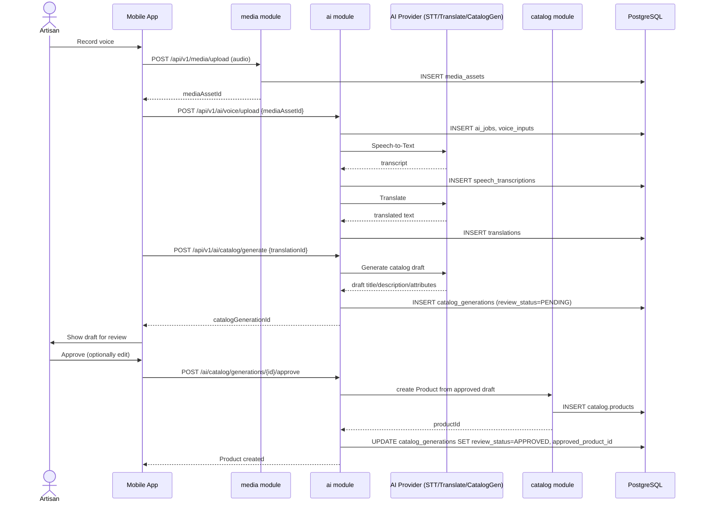
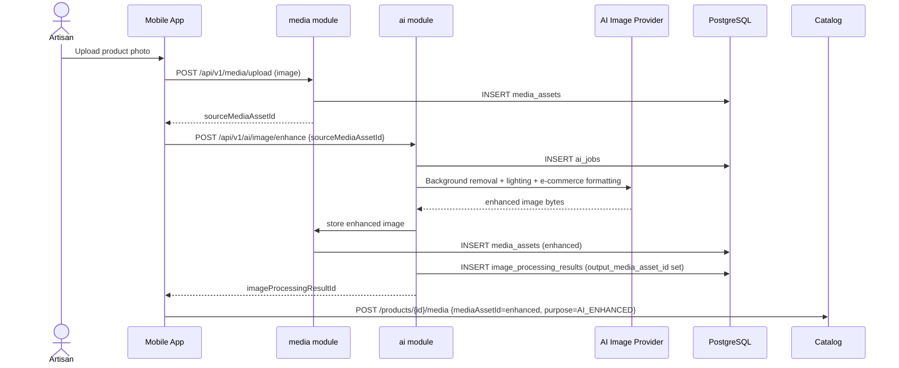
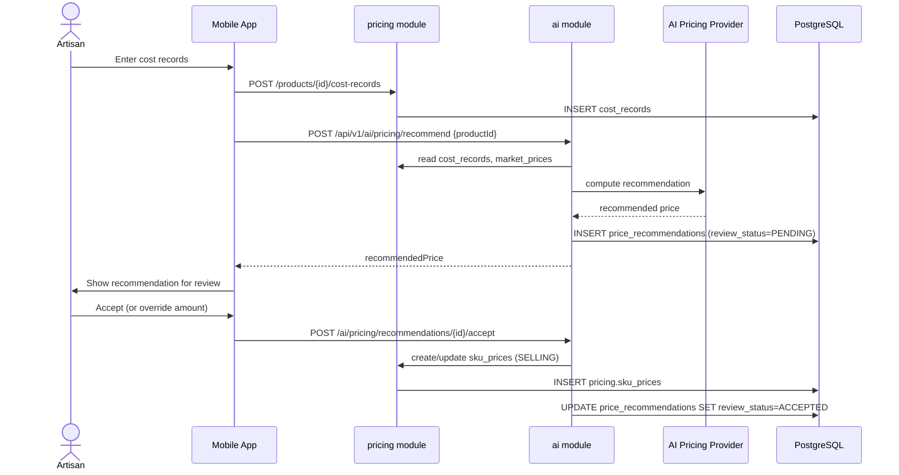
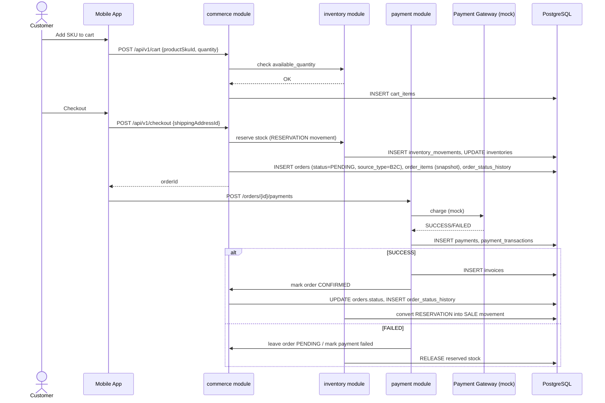
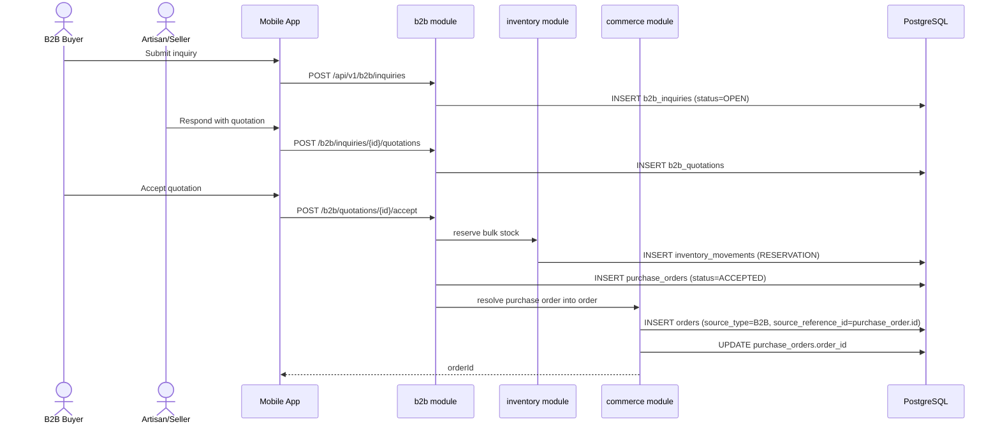
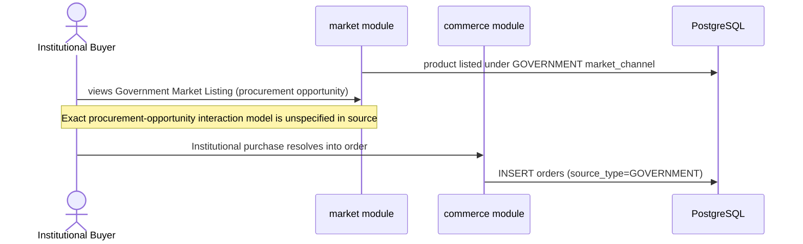
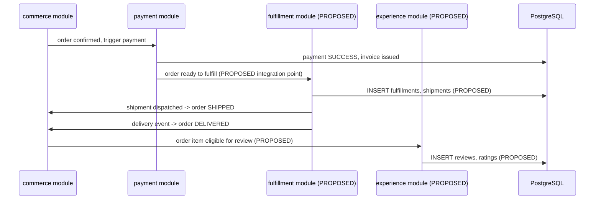

# 06 — Communication Workflows

> Because this platform is a modular monolith (`02_ARCHITECTURE_OVERVIEW.md` §3), "communication between services" below means in-process, synchronous method calls between module service layers unless explicitly marked otherwise. There is no message broker in the MVP (see `07_QUEUE_AND_CACHE_DESIGN.md` for the reasoning).

## 1. Sync vs Async Decision Matrix

| Interaction | Sync or Async | Reasoning |
|---|---|---|
| Frontend → any backend module (all REST calls) | Sync (request/response) | REST over HTTPS is the only integration style named in source (§27, §30). |
| `catalog` → `seller`, `catalog` → `media`, `commerce` → `inventory`, etc. (in-process module calls) | Sync (in-process method call) | Single deployable; no network hop exists between modules under the modular-monolith decision. |
| `ai` module → external AI provider (STT, translation, catalog gen, image enhance, pricing) | **Async from the client's perspective, sync from the backend's perspective** | The AI call itself may be a synchronous HTTP call from Spring Boot to the provider, but the mobile client never blocks waiting for it — it submits a request, receives an `aiJobId` immediately, and polls/reads job status (source: `ai.ai_jobs` table exists specifically to track jobs, implying a job/poll pattern rather than a blocking request). |
| `payment` module → payment gateway adapter | Sync | A checkout/payment action needs an outcome (SUCCESS/FAILED) before the order can proceed to CONFIRMED; source shows no asynchronous settlement step for payment itself (settlement to seller is a separate, later step). |
| `market` → external marketplace (MANUAL/API/FILE) | Async (future) | Explicitly deferred/future-compatible in source (§19); FILE mode is inherently batch/async, API mode may be sync or async depending on the eventual provider — not yet built. |
| Fulfillment/delivery status updates → `commerce.order_status_history` (PROPOSED) | Sync (in-process) | Same monolith; no broker needed even once fulfillment exists, unless a real carrier webhook is later integrated. |

> ⚠️ Open Question: The source implies an async job pattern for AI (via `ai_jobs`) but never explicitly states whether the mobile client polls, uses long-polling, or awaits a push notification — blocks: 06_COMMUNICATION_WORKFLOWS.md, 13_FRONTEND_DASHBOARD_PLAN.md

## 2. Sequence Diagrams for Critical User Journeys

### 2.1 Voice → Catalog (source §15)

### 2.2 AI Image Studio (source §16)

### 2.3 AI Dynamic Pricing (source §17)

### 2.4 B2C Purchase (Cart → Checkout → Order → Payment)

### 2.5 B2B Inquiry → Quotation → Purchase Order → Commerce Order

### 2.6 Government / Institutional Procurement (source §25)

> ⚠️ Open Question: Source §25 names "Procurement Opportunity" and "Institutional Purchase" as concepts but defines no entities, endpoints, or actor authentication model for them, unlike the parallel B2B flow which is fully specified — blocks: 06_COMMUNICATION_WORKFLOWS.md, 04_DATA_MODEL_AND_OWNERSHIP.md, 05_API_CONTRACTS.md, 01_PRODUCT_SCOPE.md

### 2.7 Order → Payment → Fulfillment → Delivery → Review (end-to-end, source §26)

## 3. Event-Driven Flows

The source workflow contains no event bus, message broker, or explicit "event" vocabulary anywhere (no `*_events` table except the proposed `fulfillment.delivery_events`, which is itself just a log table, not a published event). Under the modular-monolith decision, cross-module "events" in this system are **synchronous in-process method calls and direct writes to history/status tables**, not published/subscribed messages.

For documentation completeness, the state transitions that a future event-driven refactor would naturally emit as domain events are catalogued here, so the shape is ready if the team later approves extracting a real event bus (see `07_QUEUE_AND_CACHE_DESIGN.md` for that decision path):

| Conceptual event (not currently implemented as a message) | Producer module | Consumer(s) today (via direct call) |
|---|---|---|
| `CatalogGenerationApproved` | `ai` | `catalog` (creates Product) |
| `PriceRecommendationAccepted` | `ai` | `pricing` (creates SKU price) |
| `ImageEnhancementCompleted` | `ai` | `media`, `catalog` |
| `OrderPlaced` | `commerce` | `inventory` (reserve), `payment` (initiate) |
| `PaymentSucceeded` | `payment` | `commerce` (confirm order), `inventory` (finalize sale) |
| `PaymentFailed` | `payment` | `commerce`, `inventory` (release reservation) |
| `QuotationAccepted` | `b2b` | `inventory` (reserve), `commerce` (create order) |
| `OrderShipped` / `OrderDelivered` (PROPOSED) | `fulfillment` | `commerce` (status history), `experience` (unlock review) |

> ⚠️ Open Question: No event/message schema exists in source; the table above is a forward-looking design aid only, not a current requirement — blocks: 06_COMMUNICATION_WORKFLOWS.md, 07_QUEUE_AND_CACHE_DESIGN.md

## 4. Error Propagation and Retry Semantics per Communication Pattern

| Pattern | Error propagation | Retry semantics |
|---|---|---|
| Frontend → backend REST | Standard HTTP status + JSON error envelope (`{error: {code, message}}` — shape PROPOSED, not specified in source) | Client-side retry only for idempotent GETs and for AI job polling; POSTs are not auto-retried by the client to avoid duplicate side effects. |
| Backend module → module (in-process) | Java exception propagation; caller translates to an HTTP error response at the controller boundary | No retry needed — in-process calls fail deterministically (no network partition possible within one JVM). |
| `ai` module → external AI provider | Provider error/timeout is caught, recorded on `ai_jobs.status=FAILED` / `error_message`, and surfaced to the client as a 422 | Bounded retry (e.g., up to 3 attempts with exponential backoff) at the adapter layer before marking the job FAILED — reasoned from principle #14 (isolate external integrations behind adapters), not stated numerically in source. |
| `payment` module → payment gateway | Gateway error/timeout recorded as a FAILED `payment_transactions` row | No automatic retry of a charge attempt (to avoid double-charging); the user must explicitly retry payment, creating a new transaction attempt. |

> ⚠️ Open Question: No retry counts, backoff intervals, or timeout values are specified anywhere in source for any integration — all numeric values above are reasoned defaults — blocks: 06_COMMUNICATION_WORKFLOWS.md, 12_FAILURE_RESILIENCE_PLAN.md

## 5. Idempotency Requirements per Consumer

| Operation | Idempotency requirement | Mechanism |
|---|---|---|
| `POST /api/v1/ai/catalog/generate` | Idempotent per `translationId`/`voiceInputId` — resubmitting for the same input should return the existing pending/completed generation rather than creating a duplicate AI spend. | Unique constraint / lookup-before-create on the source reference (PROPOSED). |
| `POST /orders/{id}/payments` | Idempotent per order — a second payment attempt while one is already SUCCESS must be rejected (409), not double-charge. | Check existing `payments`/`payment_transactions` state before invoking the gateway. |
| `POST /b2b/quotations/{id}/accept` | Idempotent — accepting an already-accepted quotation must not create a second purchase order. | Status check (`status != PENDING` → 409). |
| `POST /api/v1/checkout` | Idempotent per cart — retried checkout on the same cart should not create two orders. | Cart status transition to `CHECKED_OUT` gates re-checkout. |
| Inventory movement writes | Not idempotent by nature (each movement is a distinct ledger entry) but must be **exactly-once** per triggering business event, achieved by the triggering module (checkout, quotation acceptance) calling inventory exactly once per state transition inside the same backend transaction. | Same-transaction write (single JVM, single DB transaction — no distributed transaction problem exists under the modular monolith). |

> ⚠️ Open Question: None of these idempotency rules are explicitly stated in source; they are reasoned from the data model's uniqueness constraints and the general "don't duplicate" principles (#3, #16) — blocks: 06_COMMUNICATION_WORKFLOWS.md, 05_API_CONTRACTS.md
