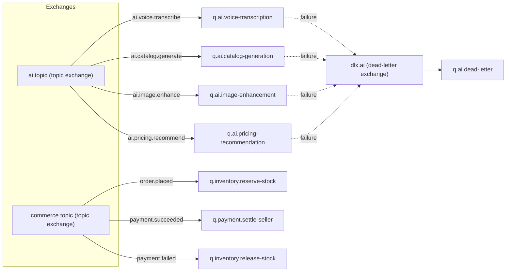

# 07 — Queue and Cache Design

## 0. Framing Decision (read before the rest of this document)

The source workflow document never mentions a message queue, message broker, event bus, or cache layer anywhere in its 45 sections. It describes one Spring Boot backend, one PostgreSQL database, local file storage, and AI/payment integrations invoked directly by the backend (source §5, §6, §14, §31). Architecture principle #2 ("Do not introduce a new technology when an existing project technology already satisfies the requirement") and principle #43 (hackathon MVP — avoid non-essential enterprise features) both directly bear on whether RabbitMQ and Redis belong in this system at all.

**Decision for the MVP: no message broker and no dedicated cache layer are introduced.** Every interaction the source describes (voice → AI → catalog, image enhancement, pricing, cart/checkout, B2B negotiation, payment) is satisfiable by direct synchronous service calls and an `ai.ai_jobs` status-polling pattern within the single Spring Boot process, exactly as documented in `06_COMMUNICATION_WORKFLOWS.md`. Introducing RabbitMQ and Redis now would violate principle #2, add operational surface (broker cluster, cache cluster) with no corresponding requirement in the workflow, and contradict the modular-monolith style decided in `02_ARCHITECTURE_OVERVIEW.md`.

Both parts of this document are still written in full per the required structure, split into **(a) the MVP decision and its justification**, and **(b) a PROPOSED future design**, clearly marked, for if/when the team approves introducing this infrastructure (principle #17: any proposed architecture change is marked PROPOSED until approved). Nothing in part (b) is currently implemented or currently required.

> ⚠️ Open Question: The workflow document never states whether asynchronous messaging or caching is out of scope by omission or by deliberate exclusion — this entire document's structure exists only because the document-generation template mandates it; the team should confirm the no-broker/no-cache MVP decision explicitly — blocks: 07_QUEUE_AND_CACHE_DESIGN.md, 02_ARCHITECTURE_OVERVIEW.md, 16_ADR_PACK.md

---

## Part A — Queue Design

### A.1 MVP Decision

No RabbitMQ (or any broker) is deployed for the MVP. The `ai.ai_jobs` table (source §14) already provides the mechanism the workflow actually needs: an async-looking client experience (submit → poll status → get result) implemented with plain synchronous backend code — the "job" is just a database row, and the "queue" is, at most, a single in-process thread pool (Spring's `@Async` / a bounded `ExecutorService`) handling AI provider calls without blocking the HTTP request thread.

| Workflow need | MVP mechanism (no broker) |
|---|---|
| Client shouldn't block on slow AI calls | Backend accepts the request, creates an `ai_jobs` row (status=QUEUED), returns immediately with the job id, and processes the AI call on a background thread within the same JVM; client polls `GET /api/v1/ai/jobs/{id}`. |
| Retry a failed AI call | In-process retry logic inside the adapter (bounded attempts, see `06_COMMUNICATION_WORKFLOWS.md` §4), not a broker-level redelivery. |
| Decouple catalog/pricing writes from AI completion | Already achieved by the human-approval gate (`ai.catalog_generations.review_status`, `ai.price_recommendations.review_status`) — no messaging needed because a person, not an event, triggers the next step. |

### A.2 PROPOSED Future Design (RabbitMQ) — not implemented, not required for MVP

If the team later approves moving to asynchronous, broker-mediated processing (e.g., because AI provider latency or volume outgrows a single-JVM thread pool), the following topology is the recommended starting point, kept consistent with the domain/module names already established.

#### A.2.1 Exchange and Queue Topology (PROPOSED)



#### A.2.2 Per-Queue Definition (PROPOSED)

| Queue | Type | Durable | Routing key | TTL | DLQ |
|---|---|---|---|---|---|
| `q.ai.voice-transcription` | Classic | Yes | `ai.voice.transcribe` | 5 min | `q.ai.dead-letter` |
| `q.ai.catalog-generation` | Classic | Yes | `ai.catalog.generate` | 5 min | `q.ai.dead-letter` |
| `q.ai.image-enhancement` | Classic | Yes | `ai.image.enhance` | 10 min | `q.ai.dead-letter` |
| `q.ai.pricing-recommendation` | Classic | Yes | `ai.pricing.recommend` | 5 min | `q.ai.dead-letter` |
| `q.inventory.reserve-stock` | Classic | Yes | `order.placed` | 1 min | `q.commerce.dead-letter` |
| `q.payment.settle-seller` | Classic | Yes | `payment.succeeded` | 1 hr | `q.commerce.dead-letter` |
| `q.inventory.release-stock` | Classic | Yes | `payment.failed` | 1 min | `q.commerce.dead-letter` |
| `q.ai.dead-letter` | Classic | Yes | (DLX target) | none | — |
| `q.commerce.dead-letter` | Classic | Yes | (DLX target) | none | — |

#### A.2.3 Per-Event Schema (PROPOSED JSON)

```json
{
  "eventId": "uuid",
  "eventType": "ai.catalog.generate",
  "occurredAt": "ISO-8601 timestamp",
  "payload": {
    "aiJobId": "uuid",
    "translationId": "uuid",
    "sellerId": "uuid"
  }
}
```

Same envelope shape (`eventId`, `eventType`, `occurredAt`, `payload`) reused across all queues for consistency with the "consistent conventions across domains" principle (source §30, generalized to events).

#### A.2.4 Consumer Group Design and Concurrency

- One consumer group per queue, one consumer application instance per AI capability (STT, translation, catalog-gen, image-enhance, pricing) if/when these are ever split out of the monolith; until then, consumers are just background listener beans inside the same Spring Boot app.
- Concurrency: bounded prefetch (PROPOSED: 5–10 messages in flight per consumer) to avoid overwhelming the external AI provider's own rate limits.

#### A.2.5 Poison Message Handling and Dead-Letter Strategy

- A message that fails processing after N bounded retries (PROPOSED: 3) is routed to its queue's dead-letter exchange rather than requeued indefinitely.
- Dead-lettered AI messages update the corresponding `ai_jobs.status = FAILED` so the client-facing job-status contract stays accurate regardless of whether processing happened synchronously (MVP) or via broker (future).

#### A.2.6 Queue Monitoring and Alerting Hooks (PROPOSED)

- Queue depth and consumer lag exposed via RabbitMQ's management API / Prometheus exporter, feeding the observability stack described in `11_OBSERVABILITY_AND_INCIDENTS.md`.
- Alert when `q.*.dead-letter` receives any message (should be near-zero in steady state).

---

## Part B — Cache Design

### B.1 MVP Decision

No Redis (or any dedicated cache tier) is deployed for the MVP. The source names no session-affinity requirement, no rate-limiting requirement, no pub/sub requirement, and no distributed-lock requirement anywhere. Where a cache-shaped need exists, the minimal-new-technology answer (principle #2) is Spring Boot's built-in in-memory caching abstraction (`@Cacheable`, backed by Caffeine or the default `ConcurrentMapCacheManager`) which requires zero additional infrastructure, rather than standing up a Redis cluster.

| Use case | MVP mechanism (no Redis) |
|---|---|
| Session/auth state | Stateless token (see `08_SECURITY_AND_VAULT.md` Part C) — no server-side session store needed at all. |
| Read-heavy catalog/category browse | Optional in-process Caffeine cache on `catalog.categories` (rarely changes) and hot `catalog.products` reads, with a short TTL and explicit eviction on write. |
| Rate limiting (see `05_API_CONTRACTS.md` §4) | In-memory per-instance counter (e.g., Bucket4j with an in-memory backend), acceptable because the MVP runs a single backend instance — this is explicitly a single-instance-only shortcut. |
| Pub/sub | Not needed — no cross-instance fan-out exists in a single-instance monolith. |
| Distributed locks | Not needed — a single JVM can use in-process locks (`synchronized`, `ReentrantLock`) or database-level `SELECT ... FOR UPDATE` for correctness-critical sections like inventory reservation, since there is only one process to coordinate. |

> ⚠️ Open Question: The in-memory rate-limiting and in-process-locking shortcuts above are valid only as long as the backend runs as a single instance; if the team scales the backend horizontally before introducing Redis, both mechanisms silently stop working correctly (each instance would have its own counter/lock) — this is a real risk not addressed anywhere in the source workflow — blocks: 07_QUEUE_AND_CACHE_DESIGN.md, 12_FAILURE_RESILIENCE_PLAN.md, 10_CI_CD_AND_ENVIRONMENTS.md

### B.2 PROPOSED Future Design (Redis) — not implemented, not required for MVP

If the team later approves horizontal scaling of the backend (multiple instances behind a load balancer), the in-memory shortcuts in B.1 stop being correct, and Redis becomes the appropriate minimal addition at that point — not before.

#### B.2.1 Use-Case Catalogue (PROPOSED)

| Use case | Key schema | TTL | Eviction policy | Serialization |
|---|---|---|---|---|
| Session/token blacklist (for logout/revocation) | `session:blacklist:{tokenId}` | Token's remaining lifetime | TTL expiry | Plain string |
| Product/category read cache | `cache:product:{productId}`, `cache:category-tree` | 5 min | TTL + explicit invalidation on write | JSON |
| Rate limiting | `ratelimit:{userId}:{endpoint}` | 1 min sliding window | TTL expiry | Integer counter |
| Distributed lock (inventory reservation across instances) | `lock:inventory:{skuId}` | 5 sec (lock hold timeout) | Explicit release / TTL failsafe | Plain string (lock token) |
| Pub/sub (AI job completion notification across instances) | Channel `ai-job-events` | N/A (transient) | N/A | JSON event envelope |

#### B.2.2 Cluster vs Standalone (PROPOSED)

Standalone Redis is sufficient at MVP-successor scale (single region, moderate throughput); Redis Cluster would only be justified once data volume or throughput exceeds a single node's capacity — no such requirement exists anywhere in the source, so this decision is deferred entirely rather than pre-committed.

#### B.2.3 Cache Invalidation Strategy per Domain

- `catalog`: invalidate `cache:product:{id}` on any product/SKU/attribute/media write.
- `market`: invalidate listing caches on channel/listing status change.
- No other domain is cache-eligible under the read patterns implied by the source (pricing, inventory, and order data are all either write-heavy or require strong consistency, making them poor cache candidates).

#### B.2.4 Failure Behaviour: Cache-Miss Fallback per Use Case

- Product/category cache: miss falls back to PostgreSQL read — cache is purely an optimization, never a source of truth (consistent with principle #33.1, "PostgreSQL is the source of persistent relational data").
- Rate limiting: if Redis is unreachable, PROPOSED fail-open (allow the request) rather than fail-closed, since a rate-limiter outage should not take down the whole platform for a hackathon-scale product; a production-hardened version might choose fail-closed instead — this trade-off is not addressed in source and is flagged for team decision.

> ⚠️ Open Question: Fail-open vs fail-closed behavior on cache/rate-limiter outage is a real product/security trade-off not addressed anywhere in the source — blocks: 07_QUEUE_AND_CACHE_DESIGN.md, 12_FAILURE_RESILIENCE_PLAN.md
