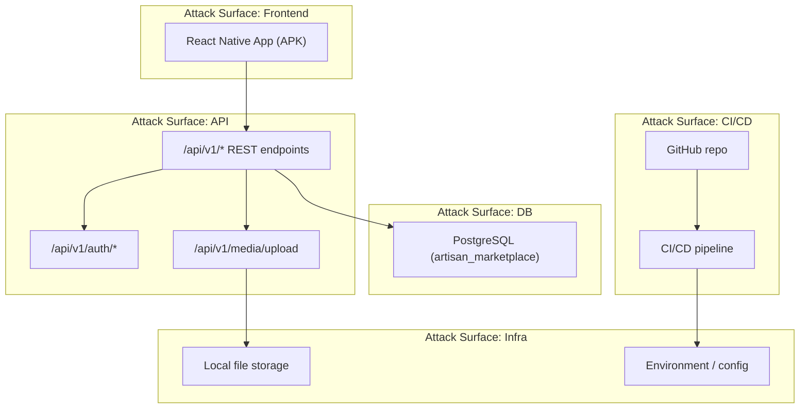

# 08 — Security, Secrets, and Auth Architecture

## Part A — Threat Model

### A.1 System Assets and Value Classification

| Asset | Classification | Why |
|---|---|---|
| `identity.users.password_hash` | Critical | Compromise enables full account takeover platform-wide. |
| Payment references (`payment.payments.gateway_reference`, transaction IDs) | Critical | Financial fraud surface, even without card data stored (source §22, §40 explicitly forbid storing card/CVV, which narrows but does not eliminate this asset's sensitivity). |
| PII (`identity.users` email/phone, `identity.addresses`) | Sensitive | Personal data; artisan and buyer trust depends on its protection. |
| B2B organization data (`b2b.b2b_buyers` tax identifier, org name) | Sensitive | Business-confidential and potentially regulated (tax ID). |
| Product/catalog/media content | Internal-to-Public | Product listings are meant to be publicly visible once live; pre-approval AI drafts (`ai.catalog_generations` pending review) are internal until approved. |
| AI job inputs/outputs (voice recordings, transcripts) | Sensitive | Voice recordings are biometric-adjacent personal data; transcripts may contain personal/business detail. |
| Source code / CI/CD credentials | Critical | Compromise enables supply-chain attacks against the whole platform. |
| Media storage path / filesystem | Internal | Direct filesystem access could expose all uploaded media if the storage path scheme is guessable (principle #32.4: "avoid exposing arbitrary filesystem paths directly to clients"). |

### A.2 Threat Actors and Capabilities

| Actor | Capability |
|---|---|
| Unauthenticated external attacker | Network access to public endpoints only; attempts credential stuffing, SQL injection, enumeration. |
| Authenticated malicious buyer/seller | Valid account; attempts privilege escalation (accessing another seller's products/orders), IDOR against `{id}` path parameters. |
| Malicious B2B buyer | Attempts to abuse the inquiry/quotation flow for competitive intelligence (e.g., scraping seller cost data if pricing internals leak). |
| Compromised AI provider / man-in-the-middle on AI adapter calls | Could return malicious data attempting to inject into catalog/pricing if the "no direct write, human review required" gate (principle #9) were bypassed in implementation. |
| Insider (developer with repo/CI access) | Could commit secrets, weaken CI security scanning, or bypass code review. |
| Automated scraper/bot | Enumerates public catalog endpoints at high volume. |

### A.3 Attack Surface Map



- **APK reverse-engineering:** since APK distribution is the MVP deployment target (source §28), any secret embedded in the mobile bundle (API keys, base URLs) must be treated as public — the app must hold no backend secrets, only its own API base URL.
- **Upload endpoint abuse:** `/api/v1/media/upload` is the highest-risk single endpoint — unauthenticated or authenticated abuse could exhaust storage or upload malicious files if MIME/size validation (principle #32.5) is not enforced server-side.

### A.4 STRIDE Analysis per Module

| Module | Spoofing | Tampering | Repudiation | Info Disclosure | DoS | Elevation of Privilege |
|---|---|---|---|---|---|---|
| `auth` | Credential stuffing against `/auth/login` | Token forgery if signing key weak | No audit log of login attempts specified in source | Password hash leak via misconfigured error messages | Login endpoint flood | Role tampering via client-supplied role claims |
| `catalog` | N/A (public read) | Unauthorized product edit (IDOR on `/products/{id}`) | No edit history table exists in source | Draft/unapproved AI content exposed before review | Scraper flood on public browse | A seller editing another seller's product |
| `media` | N/A | Malicious file upload (wrong MIME, oversized) | No upload audit trail specified | Storage path traversal exposing other users' files | Storage exhaustion via repeated uploads | N/A |
| `ai` | Forged AI job ownership | Tampered AI provider response bypassing review gate | `ai_jobs` provides some audit trail (job status, model version) | AI provider given more data than needed (e.g., full voice recording sent to third party) | Abusive volume of AI requests driving cost | AI-originated data written to core entities without review (explicitly forbidden by principle #9) |
| `pricing` | N/A | Unauthorized price manipulation | No price-change audit beyond `valid_from`/`valid_to` | Cost record data (business-sensitive) leak to competitors | N/A | Non-owner setting another seller's SKU price |
| `b2b` | Forged buyer identity in inquiry | Tampered quotation terms after send | No explicit audit table for negotiation history | Buyer/seller data (tax ID, target price) cross-exposure | Inquiry spam | Buyer accepting a quotation not addressed to them |
| `commerce` | N/A | Order total/quantity tampering client-side | `order_status_history` provides transition audit trail | Order details exposed to non-parties (IDOR) | Cart/checkout flood | Customer viewing another customer's order |
| `payment` | Forged payment success client-side | Replay of a transaction ID | `payment_transactions` provides audit trail | Payment reference leak | Refund abuse (repeated refund requests) | Non-owner triggering a refund |
| `fulfillment` (PROPOSED) | N/A | Tampered delivery event | `delivery_events` log provides some audit trail | Tracking info exposed to non-parties | N/A | N/A |
| `experience` (PROPOSED) | Fake reviews from non-purchasers | Rating manipulation/brigading | No moderation flow specified | N/A | Review spam | N/A |

### A.5 Security Controls Mapped to Threats

| Threat | Control |
|---|---|
| Credential stuffing | Hashed passwords (bcrypt/argon2-class hash, source §8.1/§40), login rate limiting (see `05_API_CONTRACTS.md` §4), account lockout (PROPOSED, not in source). |
| IDOR (cross-tenant access) | Ownership check in every module's service layer before any read/write of a non-public resource (source principle #7, "backend owns business logic"). |
| Malicious file upload | Server-side MIME/size validation, storage under generated UUID filenames, no client-controlled path (principle #32.3–32.5). |
| AI bypassing human review | Hard architectural constraint: AI modules never call `catalog`/`pricing` write methods directly; only the approval endpoint does (principle #9, #31.7) — this is a code-review-enforced control, not merely a policy statement. |
| Secrets in source control | `.gitignore` covering config/secrets, CI secret scanning (see `10_CI_CD_AND_ENVIRONMENTS.md`), never commit DB passwords (principle #33.10). |
| Uploaded files committed to Git | `.gitignore` for the `uploads/` runtime directory (source §32.8, §35). |

### A.6 Penetration Testing Scope and Plan

Not specified in source. Reasoned minimal plan appropriate to an MVP:

- Scope: public REST API surface (`/api/v1/*`), authentication flow, file upload endpoint, IDOR checks across all owner-scoped endpoints.
- Out of scope for MVP: infrastructure/network-layer testing of the eventual cloud provider (unspecified, source §28), since the provider itself isn't chosen yet.
- Timing: after MVP feature-complete, before any public/judge-facing demo URL is shared, and again before any post-hackathon production hardening phase.

> ⚠️ Open Question: No penetration testing scope, cadence, or vendor is specified in source — blocks: 08_SECURITY_AND_VAULT.md, 09_TESTING_STRATEGY.md

### A.7 Compliance Requirements

See `01_PRODUCT_SCOPE.md` §5.5 — no specific regime is named in source; basic PII hygiene and card-data avoidance (already architecturally enforced by never storing card data) are the concrete, source-derived controls.

### A.8 Data Classification

| Class | Examples |
|---|---|
| PII | `identity.users` (email, phone, full name), `identity.addresses`, `b2b.b2b_buyers` (org contact info) |
| Sensitive | Password hashes, voice recordings/transcripts, payment references, cost records (business-sensitive) |
| Internal | Unapproved AI drafts/recommendations, draft product status |
| Public | Approved, listed product/catalog content, aggregate ratings (once experience domain exists) |

### A.9 Retention Policy per Data Type

Not specified in source beyond the general audit-preserving design already noted in `04_DATA_MODEL_AND_OWNERSHIP.md` §5. No retention period is stated for PII specifically.

> ⚠️ Open Question: No PII-specific retention period is defined in source — blocks: 08_SECURITY_AND_VAULT.md, 04_DATA_MODEL_AND_OWNERSHIP.md

### A.10 Right to Erasure and Anonymisation Flows

Not described anywhere in the source workflow — no account-deletion or anonymisation flow is specified.

> ⚠️ Open Question: No right-to-erasure or anonymisation flow exists in the source; if any compliance regime requiring this is later adopted (per the open question in §A.7), this flow must be designed from scratch — blocks: 08_SECURITY_AND_VAULT.md, 01_PRODUCT_SCOPE.md

### A.11 Audit Log Requirements and Immutability Guarantees

The source provides domain-specific history tables (`inventory.inventory_movements`, `commerce.order_status_history`) but no general-purpose, cross-domain security audit log (e.g., "who accessed/modified what, when"). This is a gap relative to what a STRIDE-hardened system would normally require.

> ⚠️ Open Question: No general security audit-log table or immutability guarantee (e.g., append-only, tamper-evident) is specified in source beyond the two domain-specific history tables already documented — blocks: 08_SECURITY_AND_VAULT.md, 11_OBSERVABILITY_AND_INCIDENTS.md

### A.12 Data Processing Agreements and Third-Party Data Flow Inventory

| Third party | Data sent | Purpose |
|---|---|---|
| AI provider (STT) | Voice recording audio | Transcription |
| AI provider (Translation) | Transcript text | Translation |
| AI provider (Catalog Generation) | Translated text | Draft catalog content |
| AI provider (Image Enhancement) | Product photo | Background removal / lighting / formatting |
| AI provider (Pricing) | Cost records, market prices, product info | Price recommendation |
| Payment gateway (mock for MVP) | Payment amount, order reference (never card data) | Payment processing |

No specific vendor is named for any of these (source §5: "exact AI provider/model can be changed"), so no DPA can be identified yet — a DPA must be executed with whichever concrete providers are eventually selected.

> ⚠️ Open Question: No AI provider or payment gateway vendor is named in source, so no data processing agreement can be identified at this stage — blocks: 08_SECURITY_AND_VAULT.md

---

## Part B — Secrets and Vault Architecture

### B.1 MVP Decision

The source names no secrets-management product (no Vault, no cloud KMS, no SSM Parameter Store) anywhere. Principle #2 (no new technology beyond what's needed) and principle #33.10 ("never commit database passwords or secrets") together imply the minimal correct answer for MVP: **Spring Boot's externalized configuration** (`application.yml` profiles + environment variables), never committed to Git, injected at deploy time by whatever "suitable cloud/server environment" (source §28) the team selects.

### B.2 Secrets Taxonomy

| Category | Examples | MVP handling |
|---|---|---|
| Secret | DB password, AI provider API keys, payment gateway API key, JWT signing key | Environment variable, injected at runtime, never in source control |
| Config (non-secret) | API base path, feature toggles (none currently exist), log level | `application.yml`, safe to commit |
| Environment variable (operational) | `SPRING_PROFILES_ACTIVE`, port number | Set per deployment environment |

### B.3 Vault Mount Structure and Secret Path Conventions (PROPOSED future state)

Not implemented for MVP (see B.1). If the team later approves adopting HashiCorp Vault (e.g., once beyond hackathon scale, with multiple environments and rotation needs that plain env vars can't satisfy), the recommended mount structure mirrors the module/schema naming already established:

```text
secret/
├── artisan-platform/
│   ├── shared/               # JWT signing key, shared config
│   ├── database/             # PostgreSQL credentials
│   ├── ai/                   # per-provider API keys
│   ├── payment/               # gateway API key
│   └── ci/                    # CI/CD deploy credentials
```

### B.4 Dynamic Secrets Strategy (PROPOSED future state)

Vault's dynamic database credentials (short-lived PostgreSQL roles issued per backend instance) would be the natural next step once Vault is adopted, replacing the MVP's static DB password. Not implemented for MVP.

### B.5 Auth Method (PROPOSED future state)

Kubernetes auth method if the deployment target is Kubernetes, or AppRole otherwise — moot until both Vault and a concrete deployment target (currently unspecified, source §28) are chosen.

### B.6 Secret Rotation Policy and Lease Renewal

Not specified in source. For MVP, rotation is manual (rotate the env var and redeploy) since no automated rotation tooling is in scope. Once Vault is adopted (B.3–B.5), lease-based rotation becomes available.

### B.7 Audit Logging of Secret Access

Not implemented for MVP (no Vault, so no Vault audit device). Environment-variable-based secrets have no per-access audit trail by nature — this is an accepted MVP trade-off, not a source-specified requirement.

> ⚠️ Open Question: The entire Vault architecture requested by the document template is not applicable until the team approves adopting Vault; none of Part B beyond B.1–B.2 reflects the current, approved system — blocks: 08_SECURITY_AND_VAULT.md, 16_ADR_PACK.md

---

## Part C — Auth Architecture

### C.1 AuthN Design

Spring Security is explicit in source (§5). The exact token mechanism is not named. The minimal, standard-idiom choice for a stateless mobile REST client (no server-rendered session, per source §27 "frontend communicates only through backend APIs") is a **JWT bearer token**, issued at `/api/v1/auth/login` and sent as `Authorization: Bearer <token>` on every subsequent request.

- **Token lifecycle (PROPOSED):** short-lived access token (e.g., 15–60 minutes) plus a longer-lived refresh token, since no lifetime is specified in source.
- **Refresh strategy (PROPOSED):** `POST /api/v1/auth/refresh` exchanges a valid refresh token for a new access token; refresh tokens are revocable (supports the "logout" case even in a stateless-token architecture).

> ⚠️ Open Question: JWT vs. server-side session, and all specific token lifetimes, are not stated in source — the above is the minimal reasoned default for a mobile REST client using Spring Security — blocks: 08_SECURITY_AND_VAULT.md, 02_ARCHITECTURE_OVERVIEW.md, 13_FRONTEND_DASHBOARD_PLAN.md

### C.2 AuthZ Design: RBAC Model

The source explicitly models roles as an extensible table (`identity.roles`, `identity.user_roles`), not a fixed enum — this is **role-based access control (RBAC)**, not attribute-based (ABAC); no attribute-driven policy engine is described anywhere in source.

#### Permission Matrix per Role (reasoned from functional requirements; source defines the roles but not an explicit permission matrix)

| Capability | ADMIN | ARTISAN (seller) | CUSTOMER | B2B_BUYER |
|---|---|---|---|---|
| Browse public catalog | ✅ | ✅ | ✅ | ✅ |
| Create/edit own product, SKU, pricing, media | — | ✅ (own only) | — | — |
| Manage own inventory | — | ✅ (own only) | — | — |
| Submit voice/image/pricing AI requests | — | ✅ (own only) | — | — |
| Approve AI catalog/pricing drafts | — | ✅ (own only) | — | — |
| Add to cart / checkout (B2C) | — | — | ✅ | — |
| Submit B2B inquiry / accept quotation | — | — | — | ✅ (own only) |
| Respond to B2B inquiry with quotation | — | ✅ (own only, as seller) | — | — |
| View/pay own orders | — | ✅ (as seller, view only) | ✅ (own only) | ✅ (own only) |
| Issue refund | ✅ | ✅ (own orders — PROPOSED) | — | — |
| Platform moderation (per open question in `01_PRODUCT_SCOPE.md` §3.5) | ✅ | — | — | — |

> ⚠️ Open Question: No explicit permission matrix exists in source; the table above is reasoned entirely from the functional requirements each role implies — blocks: 08_SECURITY_AND_VAULT.md, 05_API_CONTRACTS.md

### C.3 Per-Service Auth Enforcement Pattern

Every module enforces authorization the same way, consistent with "API naming and response conventions should remain consistent across domains" (source §30, generalized): a Spring Security filter validates the bearer token and populates the security context; each controller/service method then performs an ownership check (does the authenticated user's `userId`/`sellerId` match the resource's owning FK) before any write, and a role check (`@PreAuthorize("hasRole(...)")`) before any role-gated action. No module implements its own bespoke auth logic — all rely on the same shared Spring Security configuration (see `03_SERVICE_BOUNDARIES.md` §5.2 shared library).

### C.4 Frontend Auth Flow

- **Token storage:** Secure on-device storage (Expo SecureStore or equivalent Android Keystore-backed storage) — never plain AsyncStorage, since the token is a bearer credential.
- **Refresh:** App-level HTTP client intercepts 401 responses, attempts a silent refresh via the refresh token, and retries the original request once.
- **Redirect on expiry:** If refresh also fails (refresh token expired/revoked), the app clears stored tokens and redirects to the login screen.

> ⚠️ Open Question: None of C.4's mechanics are specified in source (§27 lists "Authentication" as a frontend responsibility area with no further detail) — blocks: 08_SECURITY_AND_VAULT.md, 13_FRONTEND_DASHBOARD_PLAN.md
