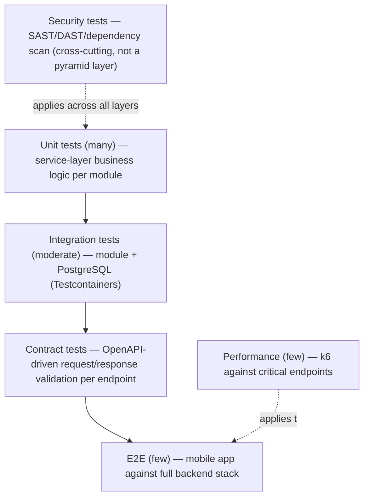

# 09 — Testing Strategy

## 1. Testing Philosophy and Coverage Targets

The source workflow's own status checklist (§37) lists "Testing" as a pending, unstarted item with no further detail — no coverage target, tool, or philosophy is specified anywhere in the 45 sections. The strategy below is reasoned from the architecture's own emphasis on correctness-critical boundaries: the human-approval gate between AI and core entities (principle #9), the never-store-plaintext/never-store-card-data rules (principle #12, #22, #40), and the shared commerce infrastructure across three channels (principle #11) — these are the places where a bug would violate an explicit architectural rule, and therefore the places test coverage matters most.

- **Philosophy:** test the architectural rules, not just the code — every hard constraint in `02_ARCHITECTURE_OVERVIEW.md` §7 should have at least one automated test that would fail if the constraint were violated (e.g., a test asserting no card data field exists on any payment DTO/entity).
- **Coverage targets (PROPOSED, not source-specified):** ≥70% line coverage on backend service-layer code, 100% of the "hard constraint" boundary logic listed above, and contract tests for every endpoint in `05_API_CONTRACTS.md`.

> ⚠️ Open Question: No coverage percentage, pass-rate threshold, or testing philosophy is stated in source — all numeric targets here are reasoned defaults for an MVP-stage hackathon project — blocks: 09_TESTING_STRATEGY.md

## 2. Test Pyramid

## 3. Per-Domain Test Scenarios

### 3.1 `auth`
- Happy path: register → login → receive token → access `/auth/me`.
- Edge case: duplicate email registration → 409.
- Failure mode: wrong password → 401; expired/tampered token → 401; missing role for a gated action → 403.

### 3.2 `seller`
- Happy path: artisan registers a seller account and artisan profile.
- Edge case: seller type COOPERATIVE/SHG/ARTISAN_GROUP created without an individual artisan profile (should still succeed — profile is artisan-specific, not universally required per source §9 reading).
- Failure mode: creating a second seller record for the same user → 409 (UNIQUE constraint).

### 3.3 `catalog`
- Happy path: create product → add SKUs with distinguishing attributes → retrieve full product detail.
- Edge case: category with deep nesting (3+ levels, per source's Handicrafts/Bamboo Crafts/Baskets example).
- Failure mode: non-owner attempts to edit a product → 403; product created with no SKUs (should this be allowed? — see open question below).

> ⚠️ Open Question: The source does not state whether a product must have at least one SKU before it can be listed — blocks: 09_TESTING_STRATEGY.md, 04_DATA_MODEL_AND_OWNERSHIP.md

### 3.4 `media`
- Happy path: upload a valid JPEG under size limit → media asset created.
- Edge case: upload exactly at the size boundary.
- Failure mode: disallowed MIME type rejected (400); oversized file rejected (413); checksum mismatch detection.

### 3.5 `inventory`
- Happy path: stock-in movement increases `available_quantity`; sale movement decreases it and logs history.
- Edge case: reservation followed by release (e.g., abandoned cart) correctly restores `available_quantity`.
- Failure mode: attempting to reserve more than `available_quantity` → 409 insufficient stock; concurrent reservation race (two checkouts for the last unit) — must not oversell.

### 3.6 `ai`
- Happy path: full voice → transcription → translation → catalog generation → artisan approval → product created chain.
- Edge case: artisan rejects/edits the AI draft before approval — approved product reflects edits, not raw AI output.
- Failure mode: AI provider timeout/error → `ai_jobs.status = FAILED`, no partial/corrupt catalog data ever reaches `catalog.products`; verify **no code path** allows an AI module to write directly to `catalog.products` or `pricing.sku_prices` (architectural-constraint test, principle #9).

### 3.7 `pricing`
- Happy path: cost records + market price → recommendation → seller accepts → SKU price created with correct `price_type=SELLING`.
- Edge case: seller overrides the recommended amount before accepting.
- Failure mode: recommendation auto-applied without an explicit accept call is architecturally impossible (constraint test).

### 3.8 `market`
- Happy path: list one product under all three channels simultaneously; verify each channel listing is independent.
- Edge case: delist from B2C while remaining listed on B2B/GOVERNMENT.
- Failure mode: duplicate listing attempt for the same product+channel → 409 (UNIQUE constraint).

### 3.9 `b2b`
- Happy path: inquiry → quotation → accept → purchase order → resolved commerce order, `source_type=B2B`.
- Edge case: quotation expires (`validity_date` passed) before acceptance — acceptance should be rejected.
- Failure mode: accepting an already-accepted quotation → 409; buyer accepting a quotation addressed to a different buyer → 403.

### 3.10 `commerce`
- Happy path: cart → checkout → order with correct item snapshots and status history entry.
- Edge case: two channels (B2B purchase order resolution and B2C checkout) both producing rows in the same `orders` table with correct, distinct `source_type`.
- Failure mode: checkout with stock that changed between add-to-cart and checkout → 409, no order created; non-owner viewing another user's order → 403.

### 3.11 `payment`
- Happy path: payment → SUCCESS transaction → invoice generated → seller settlement computed correctly (gross − commission = net, per source's ₹1000/₹50/₹950 example).
- Edge case: partial refund leaves the invoice/settlement records intact and simply adds a refund record.
- Failure mode: mock gateway returns FAILED → order remains unconfirmed, reserved stock released; verify no test or code path ever asserts/handles a card number or CVV field (constraint test, principle #22/#40).

### 3.12 `fulfillment` (PROPOSED)
- Happy path (once approved): order → fulfillment → shipment → delivery event → order status updates to SHIPPED then DELIVERED.
- Failure mode: delivery event out of order (DELIVERED before DISPATCHED) — behavior undefined in source.

> ⚠️ Open Question: Fulfillment test scenarios are speculative pending schema approval (source §23) — blocks: 09_TESTING_STRATEGY.md

### 3.13 `experience` (PROPOSED)
- Happy path (once approved): customer with a DELIVERED order item submits a review/rating.
- Failure mode: customer without a DELIVERED order item for the product attempts to review → 403.

## 4. Test Environment Strategy

| Environment | Purpose | Data |
|---|---|---|
| Local | Developer inner-loop testing | Docker-composed PostgreSQL, seeded reference data only |
| CI | Automated gate on every PR | Ephemeral PostgreSQL (Testcontainers), fresh Flyway-migrated schema per run |
| Staging | Pre-demo verification against a deployed backend | Reference data + synthetic test fixtures, reset periodically |

## 5. Test Data Management and Seeding

Reuses the seeding strategy defined in `04_DATA_MODEL_AND_OWNERSHIP.md` §4.5: reference data (`identity.roles`, `market.market_channels`) seeded everywhere; synthetic sample commerce data only in local/CI/staging, never production.

## 6. CI Pipeline Test Gates and Quality Thresholds

| Gate | Threshold (PROPOSED) |
|---|---|
| Unit test pass rate | 100% (no merge on any failing test) |
| Line coverage (service layer) | ≥70% |
| Integration tests (Testcontainers against real PostgreSQL + Flyway) | 100% pass |
| Contract tests (endpoint request/response shape vs. OpenAPI spec) | 100% pass |
| Dependency vulnerability scan | No new critical/high severity findings |
| Migration dry-run | All Flyway migrations apply cleanly to an empty DB |

## 7. Performance Testing

### 7.1 Tool Choice

No performance testing tool is named in source. **k6** is the reasoned choice: it is free, scriptable in JavaScript (aligning with the team's existing TypeScript familiarity from the React Native frontend), and requires no new infrastructure beyond a container to run it in CI or locally — consistent with principle #2.

### 7.2 SLO/SLA Definitions

Not specified in source (see open question in `01_PRODUCT_SCOPE.md` §5.1). Reasoned placeholder targets, explicitly marked PROPOSED, pending real load data from an actual hackathon demo or pilot:

| Endpoint class | Target p95 latency (PROPOSED) |
|---|---|
| Public catalog browse (`GET /products`) | < 300ms |
| Auth login | < 300ms |
| Checkout | < 500ms |
| AI-invoking endpoints (job submission only, not completion) | < 500ms (the AI work itself runs async) |

### 7.3 Baseline, Target, and Breaking-Point Thresholds

- **Baseline:** current single-instance backend under light load (reasoned default: 10 concurrent virtual users).
- **Target:** sustain the SLOs above at a moderate hackathon-demo load (PROPOSED: 50 concurrent virtual users).
- **Breaking point:** identify the load at which p95 latency exceeds 2x target or error rate exceeds 1% — informs whether horizontal scaling (and therefore the Redis/rate-limiting open question in `07_QUEUE_AND_CACHE_DESIGN.md`) becomes necessary sooner than expected.

### 7.4 Load, Stress, and Soak Test Scenarios

- **Load:** steady 50 virtual users across browse/checkout/AI-submission mix for 10 minutes.
- **Stress:** ramp from 10 to 200 virtual users to find the breaking point.
- **Soak:** 20 virtual users sustained for 2+ hours, watching for memory leaks or connection pool exhaustion (relevant given PostgreSQL is a single shared resource).

### 7.5 Performance Regression Gate in CI

PROPOSED: run a short k6 smoke load (1–2 minutes, low virtual-user count) on every merge to `main`, failing the build only on gross regression (e.g., p95 latency more than 50% worse than the last recorded baseline) — full load/stress/soak runs remain manual/scheduled, not per-PR, to keep CI fast.

> ⚠️ Open Question: No performance tooling, SLOs, or thresholds are specified in source; every number in §7 is a reasoned placeholder — blocks: 09_TESTING_STRATEGY.md, 11_OBSERVABILITY_AND_INCIDENTS.md

## 8. Security Testing

### 8.1 OWASP Top 10 Mapped to This System

| OWASP category | Relevance here |
|---|---|
| A01 Broken Access Control | IDOR risk across every owner-scoped endpoint (catalog, orders, payments) — highest-priority category for this system. |
| A02 Cryptographic Failures | Password hashing algorithm strength; JWT signing key strength. |
| A03 Injection | JPA/parameterized queries throughout — no raw SQL string concatenation in any module. |
| A04 Insecure Design | The AI-human-approval gate exists specifically to prevent an insecure-design class of bug (AI silently corrupting business data). |
| A05 Security Misconfiguration | Spring Boot Actuator endpoints must not be publicly exposed with sensitive detail. |
| A06 Vulnerable and Outdated Components | Maven dependency scanning (see §8.2). |
| A07 Identification and Authentication Failures | Login rate limiting, token expiry/revocation. |
| A08 Software and Data Integrity Failures | CI pipeline integrity (signed commits/tags — PROPOSED, not source-specified), Flyway checksum validation. |
| A09 Security Logging and Monitoring Failures | See open question on general audit logging in `08_SECURITY_AND_VAULT.md` §A.11. |
| A10 Server-Side Request Forgery | Relevant if any AI provider adapter accepts a user-supplied URL — validate/allowlist any such input. |

### 8.2 SAST / DAST Tooling and Dependency Scanning (PROPOSED, none named in source)

- **SAST:** a Java-aware static analyzer integrated into the Maven build (e.g., a SpotBugs/Semgrep-class tool) — reasoned choice requiring no new infrastructure beyond the existing Maven/CI pipeline.
- **DAST:** a lightweight authenticated API scan against a running staging deployment, targeting the endpoint catalogue in `05_API_CONTRACTS.md`.
- **Dependency scanning:** Maven dependency vulnerability scanning (e.g., OWASP Dependency-Check) as a CI gate (§6 table).

> ⚠️ Open Question: No SAST/DAST/dependency-scanning tool is named in source — the choices above are reasoned defaults requiring no new paid infrastructure — blocks: 09_TESTING_STRATEGY.md, 10_CI_CD_AND_ENVIRONMENTS.md
