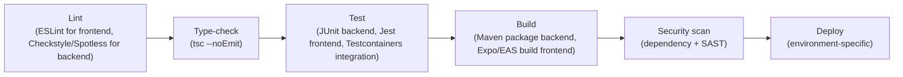
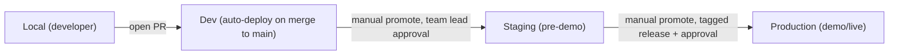

# 10 — CI/CD and Environments

## Part A — CI/CD Pipeline

### A.1 Platform Choice

The source names GitHub explicitly (§28: "Git, GitHub"; §34: full Git/GitHub collaboration workflow) but never names a CI/CD product. **GitHub Actions** is the reasoned choice: it requires no new vendor or account beyond the GitHub repository the team already uses, satisfying principle #2 (don't introduce new technology when existing tech already satisfies the requirement).

> ⚠️ Open Question: No CI/CD platform is named in source; GitHub Actions is the minimal-new-technology default given GitHub is already the source-of-truth repo host — blocks: 10_CI_CD_AND_ENVIRONMENTS.md, 16_ADR_PACK.md

### A.2 Full Pipeline Stages



| Stage | What runs | Pass/fail criteria | Artifact produced |
|---|---|---|---|
| Lint | ESLint (frontend), Checkstyle/Spotless (backend) | Zero lint errors | Lint report |
| Type-check | `tsc --noEmit` (frontend TypeScript) | Zero type errors | — |
| Test | JUnit unit + Testcontainers integration (backend), Jest (frontend) | 100% pass, coverage threshold met (`09_TESTING_STRATEGY.md` §6) | Test/coverage report |
| Build | `mvn package` (backend JAR), `expo build`/EAS build (Android APK/AAB) | Build succeeds, no compile errors | Backend JAR, Android APK/AAB |
| Security scan | Dependency vulnerability scan + SAST (`09_TESTING_STRATEGY.md` §8.2) | No new critical/high findings | Scan report |
| Deploy | Environment-specific deploy step (§B below) | Health check passes post-deploy | Deployed backend / distributed APK |

### A.3 Docker Image Build Strategy

The source does not name Docker explicitly for the backend's production runtime (only "a suitable cloud/server environment," §28), but Docker is the natural, technology-neutral packaging choice that keeps the deployment provider genuinely undecided (satisfying the source's explicit intent to leave the provider unspecified) while still giving CI something concrete to build and test locally (§B.5's docker-compose local stack requires the same image).

- **Tagging convention (PROPOSED):** `artisan-backend:<git-short-sha>` for every CI build, plus a floating `artisan-backend:latest` tag for the most recent successful `main` build, and `artisan-backend:v<semver>` for tagged releases.
- **Registry (PROPOSED):** GitHub Container Registry (`ghcr.io`) — again, no new vendor beyond GitHub.

> ⚠️ Open Question: Docker/containerization is not named in source at all for the backend; it is the reasoned minimal packaging choice consistent with "exact provider is an implementation decision" — blocks: 10_CI_CD_AND_ENVIRONMENTS.md, 16_ADR_PACK.md

### A.4 Branch Strategy

Explicit in source (§34): `main` (stable, integrated) plus `feature/...` and `fix/...` branches, one branch per meaningful unit of work (not per class/package), merged via Pull Request. This is a lightweight trunk-based-with-feature-branches model, not full GitFlow (no `develop`, `release/*`, or `hotfix/*` branches are described in source).

```bash
git checkout main
git pull origin main
git checkout -b feature/<feature-name>
# develop and test
git add .
git commit -m "Implement <feature>"
git push -u origin feature/<feature-name>
# open PR, merge into main
```

### A.5 Rollback Strategy per Environment

Not specified in source. Reasoned minimal approach given the Docker+tag scheme above: redeploy the previous known-good image tag (`artisan-backend:<previous-git-sha>`) for the backend; for the database, rely on Flyway's forward-only migration model (`04_DATA_MODEL_AND_OWNERSHIP.md` §4.3) — a rollback of a bad migration is itself a new forward migration, never a destructive `flyway undo`.

> ⚠️ Open Question: No rollback procedure or tooling is specified in source — blocks: 10_CI_CD_AND_ENVIRONMENTS.md, 12_FAILURE_RESILIENCE_PLAN.md

### A.6 Pipeline-as-Code Skeleton (GitHub Actions)

```yaml
# .github/workflows/ci.yml
name: CI
on:
  pull_request:
    branches: [main]
  push:
    branches: [main]

jobs:
  backend:
    runs-on: ubuntu-latest
    services:
      postgres:
        image: postgres:16
        env:
          POSTGRES_DB: artisan_marketplace
          POSTGRES_PASSWORD: postgres
        ports: ["5432:5432"]
    steps:
      - uses: actions/checkout@v4
      - uses: actions/setup-java@v4
        with: { java-version: '21', distribution: 'temurin' }
      - name: Lint
        run: mvn -f backend/pom.xml checkstyle:check
      - name: Test (unit + integration via Testcontainers)
        run: mvn -f backend/pom.xml verify
      - name: Build
        run: mvn -f backend/pom.xml package -DskipTests
      - name: Dependency scan
        run: mvn -f backend/pom.xml org.owasp:dependency-check-maven:check

  frontend:
    runs-on: ubuntu-latest
    steps:
      - uses: actions/checkout@v4
      - uses: actions/setup-node@v4
        with: { node-version: '20' }
      - run: npm ci --prefix frontend
      - run: npm run lint --prefix frontend
      - run: npm run typecheck --prefix frontend
      - run: npm test --prefix frontend

  build-android:
    needs: [frontend]
    if: github.ref == 'refs/heads/main'
    runs-on: ubuntu-latest
    steps:
      - uses: actions/checkout@v4
      - run: npx expo prebuild --platform android
      - run: eas build --platform android --non-interactive
```

---

## Part B — Environment Strategy

### B.1 Environment Catalogue

| Environment | Purpose | Data Policy | Access Control | Deployment Frequency |
|---|---|---|---|---|
| Local | Developer inner loop | Docker-composed PostgreSQL, seeded reference + sample data | Developer's own machine | On demand (every code change) |
| Dev | Shared integration testing among team members | Reference data + shared sample data, reset periodically | Team-only, no external access | On every merge to `main` (PROPOSED continuous deploy) |
| Staging | Pre-demo verification, judge/test-user access | Reference data + synthetic fixtures | Team + invited testers | Before each demo milestone |
| Production | Hackathon-facing live/demo environment | Real user data begins accumulating here | Public (mobile app users) | Tagged releases only |

> ⚠️ Open Question: The source mentions only "local, CI, staging" in the testing-strategy template context and "a suitable cloud/server environment" generically for deployment (§28) — a formal dev/staging/production catalogue beyond that is reasoned, not source-specified — blocks: 10_CI_CD_AND_ENVIRONMENTS.md

### B.2 Environment Parity Principles

All environments run the same Docker image and the same Flyway migration set, differing only in configuration (DB connection string, AI provider credentials, log level) injected via environment variables — never via divergent code branches. Intentional differences: local uses a lighter-weight PostgreSQL container with no backups; staging/production would eventually need backup/retention configuration (not specified in source, flagged in `04_DATA_MODEL_AND_OWNERSHIP.md` §5).

### B.3 Feature Flag Strategy

As established in `02_ARCHITECTURE_OVERVIEW.md` §5.3, no feature-flag table or mechanism exists in the source data model. For MVP, environment-variable-driven toggles (Spring `@ConditionalOnProperty`) are the minimal substitute; no dedicated feature-flag service (e.g., LaunchDarkly) is warranted at this scale.

### B.4 Environment Variable Management

| Variable class | Where it lives | Who can access | How injected |
|---|---|---|---|
| Non-secret config (log level, API base path) | `application.yml` per Spring profile, committed to Git | All developers | Bundled in the deployed image |
| Secrets (DB password, AI/payment API keys, JWT signing key) | Deployment platform's environment variable store (per `08_SECURITY_AND_VAULT.md` Part B) | CI/CD service account + platform admins only | Injected at container start, never committed |

### B.5 Local Development Setup

#### Full docker-compose service definitions

```yaml
# docker-compose.yml
version: "3.9"
services:
  postgres:
    image: postgres:16
    environment:
      POSTGRES_DB: artisan_marketplace
      POSTGRES_USER: artisan
      POSTGRES_PASSWORD: artisan_dev_password
    ports: ["5432:5432"]
    volumes:
      - pg_data:/var/lib/postgresql/data

  backend:
    build: ./backend
    depends_on: [postgres]
    environment:
      SPRING_DATASOURCE_URL: jdbc:postgresql://postgres:5432/artisan_marketplace
      SPRING_DATASOURCE_USERNAME: artisan
      SPRING_DATASOURCE_PASSWORD: artisan_dev_password
      SPRING_PROFILES_ACTIVE: local
      MEDIA_STORAGE_PROVIDER: LOCAL
      MEDIA_STORAGE_LOCAL_PATH: /app/uploads
    ports: ["8080:8080"]
    volumes:
      - ./uploads:/app/uploads

volumes:
  pg_data:
```

#### Volume Mounts and Network Topology

- `pg_data` — named volume, persists PostgreSQL data across container restarts.
- `./uploads:/app/uploads` — bind mount so locally uploaded media (source §12 directory structure: `uploads/products/<id>/{original,enhanced,thumbnails}`, `uploads/voice/<id>/`, `uploads/documents/`) survives container rebuilds and is inspectable on the host.
- Default Docker Compose bridge network — `backend` reaches `postgres` by service name (`postgres:5432`); the mobile app (running on an emulator/device, not in Compose) reaches `backend` via the host machine's IP or `10.0.2.2` for the Android emulator.

#### Running the Full Stack Locally, End to End

1. `docker compose up -d postgres` — start the database.
2. `mvn -f backend/pom.xml flyway:migrate` — apply migrations (or let Spring Boot auto-run Flyway on startup, per profile config).
3. `docker compose up -d backend` (or `mvn -f backend/pom.xml spring-boot:run` for hot-reload during development).
4. `npm --prefix frontend install && npx expo start` — launch Metro bundler.
5. `a` in the Expo CLI (or scan the QR code) to launch on an Android emulator/device pointed at the local backend's base URL.

#### Common Setup Issues and Fixes

| Issue | Fix |
|---|---|
| Android emulator can't reach `localhost:8080` | Use `10.0.2.2:8080` as the API base URL from the emulator, not `localhost`. |
| Flyway migration checksum mismatch | Never hand-edit a merged migration file — add a new one instead (see `04_DATA_MODEL_AND_OWNERSHIP.md` §4.6). |
| Uploaded files missing after container rebuild | Confirm the `./uploads` bind mount is present in `docker-compose.yml` — without it, `media.media_assets.storage_path` rows point to nothing. |
| Backend fails to start with a DB auth error | Confirm `SPRING_DATASOURCE_*` env vars match the `postgres` service's configured user/password. |

### B.6 Promotion Flow Between Environments



No approval-gate tooling is named in source; the manual-approval-before-promote pattern above is the reasoned minimal control given the team is hackathon-sized and unlikely to justify a formal change-management tool.

> ⚠️ Open Question: No promotion/approval workflow is specified in source beyond the general existence of environments — blocks: 10_CI_CD_AND_ENVIRONMENTS.md
