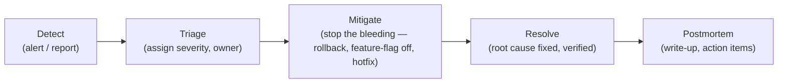

# 11 — Observability and Incident Management

## Part A — Observability

### A.1 Observability Pillars and Tooling

The source names no observability/monitoring product anywhere. Per principle #2, the minimal-new-technology stack is built on what Spring Boot already ships with:

| Pillar | Tooling (PROPOSED) | Rationale |
|---|---|---|
| Logs | SLF4J + Logback (Spring Boot default), structured JSON output | Zero new dependency — ships with Spring Boot. |
| Metrics | Spring Boot Actuator + Micrometer, scraped by Prometheus | Micrometer is Spring Boot's native metrics facade; Prometheus is the standard free scrape target. |
| Traces | Micrometer Tracing (Spring Boot 3.x native) | Native to the stack; avoids introducing a separate paid APM. |
| Dashboards | Grafana reading from Prometheus | Free, pairs naturally with Prometheus. |

> ⚠️ Open Question: No observability stack is named in source at all — the choices above are the minimal Spring-Boot-native defaults, not a source requirement — blocks: 11_OBSERVABILITY_AND_INCIDENTS.md, 16_ADR_PACK.md

### A.2 Structured Logging Schema

| Field | Description |
|---|---|
| `timestamp` | ISO-8601, UTC |
| `level` | ERROR / WARN / INFO / DEBUG |
| `correlationId` | Generated per inbound HTTP request (UUID), propagated through every module call and into any AI provider adapter call, so one user action can be traced end to end across the modular monolith's internal calls |
| `module` | `auth` / `seller` / `catalog` / ... (matches `03_SERVICE_BOUNDARIES.md` module names) |
| `userId` | Authenticated subject, if present |
| `message` | Human-readable log message |
| `context` | Free-form structured fields relevant to the event (e.g., `aiJobId`, `orderId`) |

Correlation ID convention: generated at the API gateway/controller boundary if absent, echoed back in the response as `X-Correlation-Id`, and included in every downstream log line for that request — this is the single most important logging convention given every request touches multiple modules in-process.

### A.3 Metrics Catalogue per Module (RED Method: Rate, Errors, Duration)

| Module | Rate | Errors | Duration |
|---|---|---|---|
| `auth` | Logins/sec, registrations/sec | Failed-login rate, 401/403 rate | Login latency p50/p95 |
| `catalog` | Product reads/sec, product writes/sec | 4xx/5xx rate on `/products/*` | Product read/write latency |
| `media` | Uploads/sec | Upload rejection rate (MIME/size) | Upload latency |
| `ai` | AI job submissions/sec by `job_type` | AI job failure rate by `job_type` | AI job completion duration (queued→done), external provider call latency |
| `pricing` | Price reads/writes/sec | — | — |
| `market` | Listing changes/sec | — | — |
| `b2b` | Inquiries/sec, quotations/sec | Quotation-expired-before-accept rate | Inquiry-to-quotation turnaround time |
| `commerce` | Checkouts/sec | Checkout failure rate (stock conflict) | Checkout latency |
| `payment` | Payment attempts/sec | Payment failure rate | Gateway call latency |
| `fulfillment` (PROPOSED) | Shipments created/sec | — | — |
| `experience` (PROPOSED) | Reviews/sec | — | — |

### A.4 Distributed Tracing Strategy

Because the backend is a single JVM (modular monolith), "distributed" tracing here mostly means **in-process span tracing across module boundaries plus outbound spans to external AI/payment providers** rather than tracing across a service mesh.

- **Span naming:** `<module>.<operation>` (e.g., `ai.catalog.generate`, `payment.charge`).
- **Sampling rate (PROPOSED):** 100% in local/dev/staging (low volume), reduced to a reasoned 10% in production once real traffic exists, to bound tracing overhead/cost — no source-specified value exists.
- **Trace propagation:** the same `correlationId` used in logging (§A.2) doubles as the trace ID, so logs and traces can be cross-referenced by one identifier.

### A.5 Dashboard Definitions

Per module, build one Grafana dashboard panel set covering: request rate, error rate, p50/p95/p99 latency (RED method, §A.3), and any module-specific gauge (e.g., `inventory` — count of SKUs below `reorder_level`; `ai` — count of jobs currently QUEUED/RUNNING).

### A.6 SLO Definitions per Service with Alerting Thresholds

Reused from `09_TESTING_STRATEGY.md` §7.2 (PROPOSED, not source-specified):

| Service | SLO | Alert threshold |
|---|---|---|
| `catalog` browse | p95 < 300ms, error rate < 1% | Alert if error rate > 5% over 5 min |
| `auth` login | p95 < 300ms | Alert if failed-login rate spikes >3x baseline (possible credential-stuffing) |
| `commerce` checkout | p95 < 500ms, error rate < 1% | Alert if checkout failure rate > 5% over 5 min |
| `ai` job completion | — (async, no strict latency SLO) | Alert if `ai_jobs.status=FAILED` rate > 10% over 15 min |
| `payment` | error rate < 1% | Alert immediately on any spike in FAILED transactions |

---

## Part B — Incident Management

### B.1 Incident Classification Matrix

Not specified in source. Reasoned P0–P3 matrix appropriate to a marketplace handling money and PII:

| Severity | Definition | Example | Response SLA (PROPOSED) |
|---|---|---|---|
| P0 | Full outage or data-integrity/financial-correctness break | Backend down; payments double-charging; card data accidentally logged | Acknowledge < 15 min, mitigate < 1 hr |
| P1 | Major feature broken for many users, no full outage | Checkout failing for all users; AI catalog generation completely down | Acknowledge < 30 min, mitigate < 4 hrs |
| P2 | Degraded but workable | AI image enhancement slow/intermittent; one market channel's listings not updating | Acknowledge < 4 hrs, mitigate < 1 business day |
| P3 | Minor/cosmetic, no user-blocking impact | Non-critical UI glitch; a single dashboard metric missing | Best-effort, next sprint |

> ⚠️ Open Question: No incident severity matrix or response SLA is defined in source — blocks: 11_OBSERVABILITY_AND_INCIDENTS.md

### B.2 Detection Sources

- Metrics/alerting thresholds (§A.6).
- Logs (error-level spikes correlated by `correlationId`/`module`).
- Traces (unusually slow spans).
- Synthetic monitors (PROPOSED): a scheduled health-check hitting `/api/v1/products` and `/api/v1/auth/login` every few minutes from outside the deployment, since no such monitor is named in source.

### B.3 Alert Routing and Escalation Policy

Not specified in source. Reasoned minimal policy for a hackathon-sized team: all alerts route to a single shared channel/on-call contact (no tiered escalation chain given team size); P0/P1 alerts additionally page whoever is designated on-call.

### B.4 On-Call Rotation Structure

Not specified in source — team roles (Engineering, QA, DevOps, Product) are only named generically in the roadmap document (source implies these categories exist but assigns no names). A single informal on-call rotation among backend engineers is the reasoned MVP default.

> ⚠️ Open Question: No on-call structure or named personnel exists in source — blocks: 11_OBSERVABILITY_AND_INCIDENTS.md, 14_IMPLEMENTATION_ROADMAP.md

### B.5 Incident Lifecycle



### B.6 Postmortem Template

```markdown
# Postmortem: <Incident Title>

**Date:** <date>
**Severity:** P0 / P1 / P2 / P3
**Duration:** <detection time> → <resolution time>
**Modules affected:** <e.g., commerce, payment>

## Summary
<1-2 sentence plain-language summary>

## Timeline
- HH:MM — <event>
- HH:MM — <event>

## Root Cause
<what actually caused it>

## Impact
<users/orders/revenue affected, if known>

## What Went Well
- ...

## What Went Poorly
- ...

## Action Items
| Action | Owner | Due date |
|---|---|---|
| ... | ... | ... |
```
