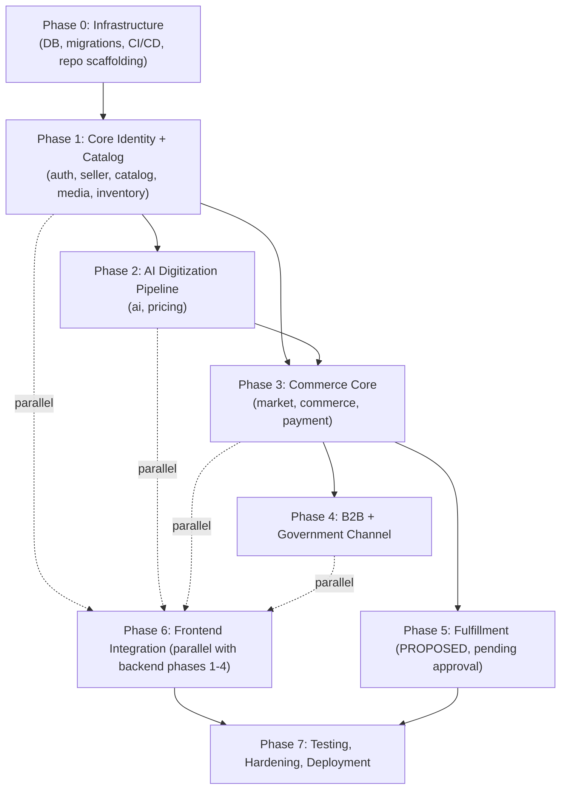

# 14 — Implementation Roadmap

## 1. Work Breakdown Structure Across Domains

## 2. Phase Definitions

### Phase 0 — Infrastructure

- **Entry criteria:** Repository created; team has PostgreSQL, Java/Maven, Node/Expo tooling installed locally.
- **Scope:** repo scaffolding (`15_REPOSITORY_STRUCTURE.md`), Flyway migration setup for the 11 approved schemas (identity through payment), CI pipeline skeleton (`10_CI_CD_AND_ENVIRONMENTS.md`), docker-compose local stack.
- **Exit criteria:** `docker compose up` brings up PostgreSQL + an empty Spring Boot shell; CI runs lint+test+build on every PR; all 11 approved schemas exist via Flyway.

### Phase 1 — Core Identity + Catalog

- **Scope:** `auth` (registration/login/roles/addresses), `seller` (seller + artisan profile), `catalog` (categories/products/SKUs/attributes), `media` (upload + storage abstraction), `inventory` (stock + movements).
- **Exit criteria:** An artisan can register, create a seller profile, manually create a product with SKUs and attributes, upload media, and see correct inventory tracking — all without any AI involvement yet (validates that AI truly is optional infrastructure per principle #8).

### Phase 2 — AI Digitization Pipeline

- **Scope:** `ai` (voice/STT/translation/catalog-gen/image-enhance/pricing-recommend job orchestration + adapters), `pricing` (cost records, market prices, SKU prices).
- **Exit criteria:** Full voice-to-catalog and image-enhancement flows work end to end against at least one concrete AI provider (provider choice is an open question — see `02_ARCHITECTURE_OVERVIEW.md` §4); every AI result requires artisan/seller approval before touching `catalog`/`pricing` (architectural constraint test from `09_TESTING_STRATEGY.md` §3.6 passes).

### Phase 3 — Commerce Core

- **Scope:** `market` (channels/listings), `commerce` (cart/checkout/orders), `payment` (mock gateway, transactions, refunds, settlements, invoices).
- **Exit criteria:** A customer can browse a listed product, add to cart, check out, pay via mock gateway, and see order status update; seller settlement computed correctly.

### Phase 4 — B2B + Government Channel

- **Scope:** `b2b` (buyers/inquiries/quotations/purchase orders), GOVERNMENT market-channel representation (source §25's minimal, listing-only scope given the open question on procurement-opportunity mechanics).
- **Exit criteria:** A B2B buyer can complete inquiry → quotation → accept → purchase order → resolved commerce order; a product can be listed and browsed under the GOVERNMENT channel.

### Phase 5 — Fulfillment (PROPOSED, gated on team approval)

- **Entry criteria:** Team has explicitly approved the fulfillment schema and scope (source §23 requires this before any creation).
- **Scope:** `fulfillment` module and schema, order status integration (SHIPPED/DELIVERED).
- **Exit criteria:** Order tracking reflects real shipment/delivery events.

### Phase 6 — Frontend Integration (parallel track)

- **Scope:** all screens in `13_FRONTEND_DASHBOARD_PLAN.md` §2, wired to whichever backend phases have landed; begins as soon as Phase 1 exposes stable auth/catalog endpoints and continues incrementally through Phase 4.
- **Exit criteria:** Installable Android APK exercising the full MVP priority list (source §43).

### Phase 7 — Testing, Hardening, Deployment

- **Scope:** full test pyramid execution (`09_TESTING_STRATEGY.md`), security review (`08_SECURITY_AND_VAULT.md`), performance baseline (k6), production deployment to the chosen cloud/server environment.
- **Exit criteria:** APK installable and demoable; backend publicly reachable over HTTPS; no P0/P1 open defects (per `11_OBSERVABILITY_AND_INCIDENTS.md` severity matrix).

## 3. Sequencing and Cross-Domain Dependencies

- `auth` blocks everything (root dependency, `03_SERVICE_BOUNDARIES.md` §4).
- `catalog`/`media`/`inventory` must exist before `ai` can have anything meaningful to write into (via approval) or before `commerce` can sell anything.
- `pricing` depends on `catalog` (SKU) and is a prerequisite for `commerce` checkout displaying a real price.
- `market` (channel listing) is a prerequisite for `commerce` (an order's channel context) and for `b2b` (B2B-channel-listed products are what buyers inquire about).
- `payment` depends on `commerce` (needs an order to pay against).
- `fulfillment` depends on `commerce` + `payment` (needs a confirmed, paid order) and on team approval of its schema.
- Frontend work on any given screen cannot start meaningfully before its backend endpoint contract (`05_API_CONTRACTS.md`) is stable, but screen scaffolding/navigation can start immediately in parallel.

## 4. Team Roles and Responsibilities

Source names no specific individuals; only generic categories appear implicitly (the roadmap document template itself, plus §37's checklist implying engineering, testing, and deployment activities). Reasoned minimal RACI for a hackathon team:

| Role | Responsibility |
|---|---|
| Engineering (Backend) | Implements modules per phase, owns Flyway migrations for their module, writes unit/integration tests |
| Engineering (Frontend) | Implements screens per `13_FRONTEND_DASHBOARD_PLAN.md`, integrates against published API contracts |
| QA | Executes the test scenarios in `09_TESTING_STRATEGY.md` §3, verifies acceptance criteria per `01_PRODUCT_SCOPE.md` §7 |
| DevOps | Owns CI/CD pipeline, environments, deployment (`10_CI_CD_AND_ENVIRONMENTS.md`) |
| Product | Owns scope decisions, resolves the ⚠️ Open Questions flagged throughout this document set, prioritizes MVP vs. deferred features |

> ⚠️ Open Question: No named individuals or team size is specified in source — blocks: 14_IMPLEMENTATION_ROADMAP.md, 03_SERVICE_BOUNDARIES.md

## 5. Risk Register

| Risk | Likelihood | Impact | Mitigation | Owner |
|---|---|---|---|---|
| No AI provider chosen yet — blocks all of Phase 2 | High | High | Resolve the open question in `02_ARCHITECTURE_OVERVIEW.md` §4 early; build the adapter interface first so any provider can be swapped in (principle #14/#5) | Product + Backend |
| Fulfillment/Experience schemas remain unapproved, blocking Phase 5 and any review features | Medium | Medium (Phase 5 is not in the MVP priority list, so this mainly risks scope creep, not the MVP itself) | Explicitly defer per `01_PRODUCT_SCOPE.md` §8.2; do not start Phase 5 until sign-off | Product |
| Inventory overselling race condition (flagged in `12_FAILURE_RESILIENCE_PLAN.md` §1) | Medium | High (customer trust, manual reconciliation cost) | Implement reservation logic inside a DB transaction with row-level locking from Phase 1 onward, not deferred to hardening | Backend |
| Hackathon time pressure causes scope creep beyond the MVP priority list (source §43) | High | Medium | Enforce the MVP boundary in `01_PRODUCT_SCOPE.md` §8 as a hard gate in sprint planning | Product |
| Mock payment gateway behavior diverges from a real gateway's edge cases, causing rework later | Medium | Low (explicitly acceptable for MVP, source §22) | Design the payment adapter interface (principle #14) so a real gateway can be substituted without touching `commerce`/`payment` module internals | Backend |
| No admin functional requirements defined — moderation/verification may be needed but undesigned | Medium | Medium | Resolve open question in `01_PRODUCT_SCOPE.md` §3.5 before Phase 3 exit, since seller/buyer verification status fields already exist in the data model and need real backing logic | Product |

## 6. Definition of Done

### Task-level
- [ ] Code implements the described acceptance criteria.
- [ ] Unit tests written and passing.
- [ ] No violation of any hard constraint in `02_ARCHITECTURE_OVERVIEW.md` §7.
- [ ] PR reviewed and merged per the branch strategy in `10_CI_CD_AND_ENVIRONMENTS.md` §A.4.

### Feature-level
- [ ] All acceptance criteria in `01_PRODUCT_SCOPE.md` §7 for the feature area are met.
- [ ] Integration tests pass against a real PostgreSQL instance (Testcontainers).
- [ ] API contract matches `05_API_CONTRACTS.md` (or the OpenAPI spec, once authored).
- [ ] Frontend screen(s) consuming the feature are wired and manually verified on an Android emulator/device.

### Release-level
- [ ] All MVP priority items in `01_PRODUCT_SCOPE.md` §8.1 are implemented and demoable end to end.
- [ ] CI pipeline green on `main`.
- [ ] Security review checklist (`08_SECURITY_AND_VAULT.md` hard constraints) passes.
- [ ] Installable Android APK produced and verified on at least one physical/emulated device.
- [ ] No open P0/P1 incidents.

## 7. Release Strategy

| Release | Ships | Rationale |
|---|---|---|
| Internal Alpha (end of Phase 3) | Core identity, catalog, AI digitization, B2C commerce | Validates the platform's core differentiator (AI-assisted digitization) and the simplest commerce channel before adding B2B complexity |
| Hackathon Demo (end of Phase 4/6) | Full MVP priority list per source §43, including B2B and Government channel representation | Matches the source's own MVP definition exactly — "100% of the important problem-statement requirements" |
| Post-Hackathon (Phase 5+) | Fulfillment, Experience, real payment gateway, S3 migration, external marketplace integrations | Everything explicitly marked TO BE IMPLEMENTED / future-compatible in source, gated on approval |
